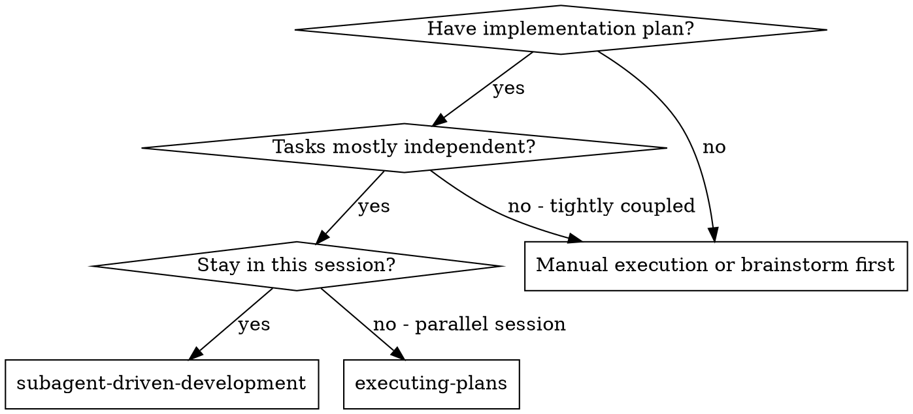
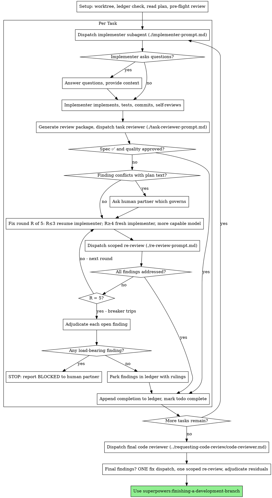

# SDD 修复循环重构实施计划

> **面向 agentic 工作者：** 必需的子技能：使用 superpowers:subagent-driven-development（推荐）或 superpowers:executing-plans 逐任务实施本计划。步骤使用复选框（`- [ ]`）语法以跟踪进度。

**目标：** 使 subagent-driven-development 的审查-修复循环具有收敛性与自主性（恢复 implementer 的修复轮次、限定范围的复审、五轮熔断器、控制器裁定），并按生命周期重组其 SKILL.md——并附法定人数（quorum）评测证据。

**架构：** 两个仓库。`superpowers` 仓库（分支 `sdd-fix-loop-redesign`，已创建；spec 已提交）获得技能重构：一个新增提示模板、两处模板编辑、一处 reference 编辑，以及完整的 SKILL.md 重写（全文见 Task 3）。`superpowers-evals` 仓库（`evals/` 检出；基于 `main` 创建分支 `sdd-fix-loop-scenarios`）获得两个 ledger 种子夹具辅助函数和三个场景，随后进行前后对照直播评测活动。

**技术栈：** Markdown 技能内容；Bash 场景 DSL（`story.md`/`setup.sh`/`checks.sh`）；基于 Bun 的 TypeScript setup-helpers（`bun test`）；quorum 直播运行。

**设计 spec：** `docs/superpowers/specs/2026-07-15-sdd-fix-loop-redesign-design.md`。开始任何任务前先阅读。

## 全局约束

- **逐字移动规则：** 当前 SKILL.md 中经评测调优的句子原样移动、不作更改。只有修复策略（fix-policy）用语可以改写，且每次改写都必须出现在 Task 3 的移动映射表中。不要"改进"被移动的正文。
- **轮次上限：** 每个任务最多 5 轮修复。第 1-3 轮恢复原 implementer；第 4-5 轮派发一个能力更强的模型上的全新 implementer。裁定只在上限处发生；唯一更早的出口是与计划文本冲突的 finding（由人类决定，既有行为）。
- **Ledger 行格式**（精确——场景会 grep 这些；`<sha7>` = 7 位短 SHA）：
  - `Task <N>: complete (commits <base7>..<head7>, review clean)`
  - `Task <N>: complete (commits <base7>..<head7>, <K> parked)`
  - `Task <N>: fix round <R>/5 (<X> addressed, <Y> open — <finding one-liner>[; <finding one-liner>…]; commits <a7>..<b7>)`
  - `Task <N>: minor (deferred): <one-liner>`
  - `Task <N>: parked — <finding one-liner> — ruling: <one-liner>`
  - `Task <N>: BLOCKED — <one-liner>`
  - 恢复规则：仅当某任务存在 `Task <N>: complete` 行时才视为 DONE。
- **模板占位符** 沿用现有方括号约定：`[MODEL]`、`[BRIEF_FILE]`、`[REPORT_FILE]`、`[BASE_SHA]`、`[HEAD_SHA]`、`[DIFF_FILE]`、`[GLOBAL_CONSTRAINTS]`；新的复审模板新增 `[FINDINGS]`、`[FIX_BASE_SHA]`。
- **提交纪律：** superpowers 在 `sdd-fix-loop-redesign` 上提交；evals 在 `sdd-fix-loop-scenarios` 上提交（独立仓库——先 `cd evals`）。绝不要在另一个仓库的工作区里提交本仓库的工作。
- **任何直播运行前的静态闸门：** `bun run check` 和 `bun run quorum check` 在 `evals/` 中通过。
- **直播运行是受信任维护者操作**——它们需要 `SUPERPOWERS_ROOT`、`ANTHROPIC_API_KEY`，且消耗真实资金（每次 SDD 运行约 $3-15）。Task 8 会明确标注。
- **冲突说明：** PR #1943（ledger 会话作用域）涉及与本计划移入 Setup 的同一份 Durable Progress 内容。不要吸收 #1943；如果它在执行期间落地，请变基并使用移动映射表重新放置其行。

## 文件结构

**superpowers 仓库：**
- 新建：`skills/subagent-driven-development/re-review-prompt.md` — 限定范围复审契约（Task 1）
- 修改：`skills/subagent-driven-development/implementer-prompt.md` — 恢复语义（Task 2）
- 修改：`skills/subagent-driven-development/task-reviewer-prompt.md` — 仅初次审查（Task 2）
- 修改：`skills/using-superpowers/references/codex-tools.md` — implementer 关闭时机（Task 2）
- 修改：`skills/subagent-driven-development/SKILL.md` — 全面重构（Task 3）

**superpowers-evals 仓库（`evals/`）：**
- 修改：`src/setup-helpers/sdd-fixtures.ts` — 新增 `scaffoldSddMidloopParked`、`scaffoldSddMidloopStructural`（Task 4）
- 修改：`src/setup-helpers/registry.ts` — 注册两个辅助函数（Task 4）
- 修改：`test/setup-helpers-sdd.test.ts` — 两个辅助函数的单元测试（Task 4）
- 新建：`scenarios/sdd-fix-loop-resumes-implementer/{story.md,setup.sh,checks.sh}`（Task 5）
- 新建：`scenarios/sdd-breaker-adjudicates-at-cap/{story.md,setup.sh,checks.sh}`（Task 6）
- 新建：`scenarios/sdd-breaker-structural-blocks/{story.md,setup.sh,checks.sh}`（Task 7）
- 新建：`docs/experiments/2026-07-sdd-fix-loop-redesign.md` — 评测活动日志（Task 8）

---

### Task 1: 创建限定范围复审模板

**文件：**
- 新建：`skills/subagent-driven-development/re-review-prompt.md`

**接口：**
- 产出：模板占位符 `[MODEL]`、`[BRIEF_FILE]`、`[REPORT_FILE]`、`[FINDINGS]`、`[FIX_BASE_SHA]`、`[HEAD_SHA]`、`[DIFF_FILE]` — Task 3 的 SKILL.md 步骤 4 引用此文件并指示控制器精确填写这些占位符。

- [ ] **步骤 1：用完全一致的内容写该文件**

````markdown
# Scoped Re-Review Prompt Template

Use this template when dispatching a re-review after a fix round. The
re-reviewer verifies the findings were addressed and checks the fix diff for
new breakage. It is not a fresh review — the full review already happened.

**Purpose:** Verify each finding from the previous review was addressed, and
that the fix itself broke nothing.

```
Subagent (general-purpose):
  description: "Re-review Task N fix round R"
  model: [MODEL — REQUIRED: choose per SKILL.md Model Selection; an omitted
         model silently inherits the session's most expensive one]
  prompt: |
    You are re-reviewing one task's fix round. A previous review produced
    findings; an implementer has attempted to fix them. Your job is to
    verdict each finding and inspect the fix diff — nothing else.

    ## The Task

    Read the task brief: [BRIEF_FILE]

    ## The Findings Under Verification

    [FINDINGS]

    ## The Fix

    Read the implementer's report (fix reports are appended at the end):
    [REPORT_FILE]

    **Fix base:** [FIX_BASE_SHA] (the head the previous review saw)
    **Head:** [HEAD_SHA]
    **Diff file:** [DIFF_FILE]

    Read the diff file once — it contains the fix commits, a stat summary,
    and the fix diff with surrounding context. Do not re-run git commands.
    If the diff file is missing, fetch the diff yourself:
    `git diff --stat [FIX_BASE_SHA]..[HEAD_SHA]` and
    `git diff [FIX_BASE_SHA]..[HEAD_SHA]`.

    Your review is read-only on this checkout. Do not mutate the working
    tree, the index, HEAD, or branch state in any way.

    ## Scope

    Your scope is the findings list and the fix diff. Verdict every finding.
    Inspect the fix diff for new problems the fix itself introduced. Do NOT
    re-review code the fix did not touch: if you notice an issue entirely
    outside the fix diff, report it under Out-of-Scope Observations — it
    does not block this task and does not extend the loop. A broad
    whole-branch review happens after all tasks are complete.

    ## Tests

    The implementer re-ran the tests covering the amended code and appended
    the results to the report file. Treat the report as unverified claims:
    confirm the fix report names the covering tests and shows their output,
    and verify the claims against the diff. Do not re-run the suite to
    confirm their report. Run a test only when reading the code raises a
    specific doubt that no existing run answers — and then a focused test,
    never a package-wide suite.

    ## Output Format

    Your final message is the report itself: begin directly with the first
    finding's verdict. Every line is a verdict, a finding with file:line,
    or a check you ran — no preamble, no process narration.

    ### Finding Verdicts

    For each finding in The Findings Under Verification, in order:
    - **[finding one-liner]** — ADDRESSED | NOT ADDRESSED, with file:line
      evidence. "Attempted" is not addressed: the specific defect must no
      longer exist.

    ### New Breakage in the Fix Diff

    Anything the fix itself broke or introduced, with severity
    (Critical/Important/Minor) and file:line. "None" if clean.

    ### Out-of-Scope Observations

    Issues you noticed entirely outside the fix diff. Non-blocking; the
    controller ledgers these for the final review. "None" if none.

    ### Verdict

    **Fix round:** [All findings addressed, no new Critical/Important
    breakage | Findings remain open] — list the open ones.
```

**Placeholders:**
- `[MODEL]` — REQUIRED: reviewer model per SKILL.md Model Selection; scoped
  re-reviews of small fix diffs take a cheap-to-mid tier
- `[BRIEF_FILE]` — the task brief file (same file the implementer worked from)
- `[FINDINGS]` — the Critical/Important findings and spec gaps from the
  previous review, copied verbatim, one per bullet
- `[REPORT_FILE]` — the implementer's report file (fix reports appended)
- `[FIX_BASE_SHA]` — the head the previous review saw
- `[HEAD_SHA]` — current commit
- `[DIFF_FILE]` — the path `scripts/review-package FIX_BASE HEAD` printed

**Re-reviewer returns:** per-finding verdicts (ADDRESSED / NOT ADDRESSED),
new breakage in the fix diff, out-of-scope observations, and a round verdict.
````

- [ ] **步骤 2：验证该文件能像其他模板一样被解析**

运行：`grep -c '^\[MODEL' skills/subagent-driven-development/re-review-prompt.md`
预期：`0`（占位符文档使用 `- \`[MODEL]\`` 列表形式，与 task-reviewer-prompt.md 一致）

运行：`grep -n 'FIX_BASE_SHA' skills/subagent-driven-development/re-review-prompt.md | head -3`
预期：在提示正文和占位符列表中均有命中。

- [ ] **步骤 3：提交**

```bash
git add skills/subagent-driven-development/re-review-prompt.md
git commit -m "feat(sdd): add scoped re-review prompt template"
```

---

### Task 2: 使 implementer 与 task-reviewer 模板以及 Codex reference 与恢复语义保持一致

**文件：**
- 修改：`skills/subagent-driven-development/implementer-prompt.md`（"After Review Findings" 部分）
- 修改：`skills/subagent-driven-development/task-reviewer-prompt.md`（结尾段落）
- 修改：`skills/using-superpowers/references/codex-tools.md`（subagent 关闭时机）

**接口：**
- 消费：`re-review-prompt.md` 已存在（Task 1）。
- 产出：Task 3 修复循环所引用的 implementer 契约（"修复、重跑覆盖测试、追加到你的报告文件、返回简短契约"）。

- [ ] **步骤 1：替换 implementer-prompt.md 中的 "After Review Findings" 部分**

旧文本（精确）：

```markdown
    ## After Review Findings

    If a reviewer finds issues and you fix them, re-run the tests that cover
    the amended code and append the results to your report file. Reviewers
    will not re-run tests for you — your report is the test evidence.
```

新文本（精确）：

```markdown
    ## After Review Findings

    If the task review finds issues, you will be resumed with the findings.
    Fix them, re-run the tests that cover the amended code, and append a fix
    report to your report file: what you changed, the covering tests you
    ran, the command, and the output. Reviewers will not re-run tests for
    you — your report is the test evidence. Then reply with the same short
    status contract as your first report.
```

- [ ] **步骤 2：删除 task-reviewer-prompt.md 结尾的复审段落**

删除以下文本（精确，位于文件末尾）：

```markdown
A fix dispatch can address spec gaps and quality findings together;
re-review after fixes covers both verdicts.
```

没有任何内容替代它——限定范围复审契约现在位于 `re-review-prompt.md` 中，SKILL.md 步骤 4（Task 3）负责循环规则。

- [ ] **步骤 3：更新 codex-tools.md 中关于 Codex subagent 关闭时机的句子**

旧文本（精确，第 10 行）：

```markdown
When using subagent-driven-development, you should always close implementer and reviewer subagents when they have finished all their work.
```

新文本（精确）：

```markdown
When using subagent-driven-development, close reviewer subagents when their review returns. Keep each implementer subagent open until its task's review passes — the fix loop resumes the implementer — then close it. If your harness cannot send another message to a spawned agent, dispatch each fix round as a fresh implementer carrying the brief, the report file, and the findings.
```

- [ ] **步骤 4：验证没有任何模板仍引用专用的修复 subagent**

运行：`grep -rn "fix subagent" skills/subagent-driven-development/*.md`
预期：无输出（SKILL.md 在 Task 3 之前仍会命中——此命令在 Task 3 之后才只限定模板；此刻预期仅在 SKILL.md 中有命中）。

运行：`grep -rn "fix subagent" skills/subagent-driven-development/implementer-prompt.md skills/subagent-driven-development/task-reviewer-prompt.md skills/subagent-driven-development/re-review-prompt.md`
预期：无输出。

- [ ] **步骤 5：提交**

```bash
git add skills/subagent-driven-development/implementer-prompt.md skills/subagent-driven-development/task-reviewer-prompt.md skills/using-superpowers/references/codex-tools.md
git commit -m "feat(sdd): align templates and codex reference with resume-based fix rounds"
```

---

### Task 3: 按生命周期重构 SKILL.md，加入修复循环与合理化表格

**文件：**
- 修改：`skills/subagent-driven-development/SKILL.md`（全文件替换；新文本如下）

**接口：**
- 消费：全部三个模板（Task 1-2）；`scripts/task-brief`、`scripts/review-package`、`scripts/sdd-workspace`（不变）。
- 产出：全局约束中的 ledger 行格式（场景会 grep 它们）；章节名 `Setup`、`The Task Loop`、`Final Review`、`Common Rationalizations`。

- [ ] **步骤 1：用完全一致的内容替换整个 SKILL.md 正文**

`````markdown
---
name: subagent-driven-development
description: Use when executing implementation plans with independent tasks in the current session
---

# Subagent-Driven Development

Execute plan by dispatching a fresh implementer subagent per task, a task review (spec compliance + code quality) after each, and a broad whole-branch review at the end.

**Why subagents:** You delegate tasks to specialized agents with isolated context. By precisely crafting their instructions and context, you ensure they stay focused and succeed at their task. They should never inherit your session's context or history — you construct exactly what they need. This also preserves your own context for coordination work.

**Core principle:** Fresh subagent per task + task review (spec + quality) + broad final review = high quality, fast iteration

**Narration:** between tool calls, narrate at most one short line — the
ledger and the tool results carry the record.

**Continuous execution:** Do not pause to check in with your human partner between tasks. Execute all tasks from the plan without stopping. The only reasons to stop are: BLOCKED status you cannot resolve, ambiguity that genuinely prevents progress, or all tasks complete. "Should I continue?" prompts and progress summaries waste their time — they asked you to execute the plan, so execute it.

## When to Use



**vs. Executing Plans (parallel session):**
- Same session (no context switch)
- Fresh subagent per task (no context pollution)
- Review after each task (spec compliance + code quality), broad review at the end
- Faster iteration (no human-in-loop between tasks)

## The Process



## Setup

Ensure the work happens in an isolated workspace: use
superpowers:using-git-worktrees to create one or verify the existing one.
Never start implementation on a main/master branch without your human
partner's explicit consent.

Conversation memory does not survive compaction. In real sessions,
controllers that lost their place have re-dispatched entire completed task
sequences — the single most expensive failure observed. Track progress in
a ledger file, not only in todos.

- At skill start, check for a ledger:
  `cat "$(git rev-parse --show-toplevel)/.superpowers/sdd/progress.md"`. Tasks with
  a `Task <N>: complete` line are DONE — do not re-dispatch them; resume at
  the first task without one. A task whose last line is a fix round is
  mid-loop: resume the loop at the next round.
- The ledger is your recovery map: the commits it names exist in git even
  when your context no longer remembers creating them. After compaction,
  trust the ledger and `git log` over your own recollection.
- `git clean -fdx` will destroy the ledger (it's git-ignored scratch); if
  that happens, recover from `git log`.

Read the plan once, note its context and Global Constraints, and create a
todo per task.

Before dispatching Task 1, scan the plan once for conflicts:

- tasks that contradict each other or the plan's Global Constraints
- anything the plan explicitly mandates that the review rubric treats as a
  defect (a test that asserts nothing, verbatim duplication of a logic block)

Present everything you find to your human partner as one batched question —
each finding beside the plan text that mandates it, asking which governs —
before execution begins, not one interrupt per discovery mid-plan. If the
scan is clean, proceed without comment. The review loop remains the net for
conflicts that only emerge from implementation.

## Model Selection

Use the least powerful model that can handle each role to conserve cost and increase speed.

**Mechanical implementation tasks** (isolated functions, clear specs, 1-2 files): use a fast, cheap model. Most implementation tasks are mechanical when the plan is well-specified.

**Integration and judgment tasks** (multi-file coordination, pattern matching, debugging): use a standard model.

**Architecture and design tasks**: use the most capable available model.
The final whole-branch review is one of these — dispatch it on the most
capable available model, not the session default.

**Review tasks**: choose the model with the same judgment, scaled to the
diff's size, complexity, and risk. A small mechanical diff does not need the
most capable model; a subtle concurrency change does. Scoped re-reviews of
small fix diffs take a cheap-to-mid tier.

**Fix-loop escalation (rounds 4-5)**: use a model at least one tier above
the implementer that got stuck.

**Always specify the model explicitly when dispatching a subagent.** An
omitted model inherits your session's model — often the most capable and
most expensive — which silently defeats this section.

**Turn count beats token price.** Wall-clock and context cost scale with how
many turns a subagent takes, and the cheapest models routinely take 2-3× the
turns on multi-step work — costing more overall. Use a mid-tier model as the
floor for reviewers and for implementers working from prose descriptions.
When the task's plan text contains the complete code to write, the
implementation is transcription plus testing: use the cheapest tier for
that implementer. Single-file mechanical fixes also take the cheapest tier.

**Task complexity signals (implementation tasks):**
- Touches 1-2 files with a complete spec → cheap model
- Touches multiple files with integration concerns → standard model
- Requires design judgment or broad codebase understanding → most capable model

## The Task Loop

Everything you paste into a dispatch prompt — and everything a subagent
prints back — stays resident in your context for the rest of the session
and is re-read on every later turn. Hand artifacts over as files.

### 1. Dispatch the implementer

Record BASE (`git rev-parse HEAD`) before dispatching — the review package
and fix-round diffs need it.

- **Task brief:** run this skill's `scripts/task-brief PLAN_FILE N` — it
  extracts the task's full text to a uniquely named file and prints the
  path. Compose the dispatch so the brief stays the single source of
  requirements. Your dispatch should contain: (1) one line on where this
  task fits in the project; (2) the brief path, introduced as "read this
  first — it is your requirements, with the exact values to use verbatim";
  (3) interfaces and decisions from earlier tasks that the brief cannot
  know; (4) your resolution of any ambiguity you noticed in the brief;
  (5) the report-file path and report contract. Exact values (numbers,
  magic strings, signatures, test cases) appear only in the brief. Never
  make a subagent read the whole plan file.
- **Report file:** name the implementer's report file after the brief
  (brief `…/task-N-brief.md` → report `…/task-N-report.md`) and put it in
  the dispatch prompt. The implementer writes the full report there and
  returns only status, commits, a one-line test summary, and concerns.
- A dispatch prompt describes one task, not the session's history. Do not
  paste accumulated prior-task summaries ("state after Tasks 1-3") into
  later dispatches — a real session's dispatch hit 42k chars of which 99%
  was pasted history. A fresh subagent needs its task, the interfaces it
  touches, and the global constraints. Nothing else.
- If an earlier task parked a finding in the area this task touches, carry
  a pointer to that ledger entry in the dispatch.
- Record the implementer's agent identity from the dispatch result —
  fix-loop rounds 1-3 resume this agent.
- Never dispatch multiple implementation subagents in parallel (conflicts).

Template: [implementer-prompt.md](implementer-prompt.md)

### 2. Handle the report

Implementer subagents report one of four statuses. Handle each appropriately:

**DONE:** Generate the review package (`scripts/review-package BASE HEAD`, from this skill's directory — it prints the unique file path it wrote; BASE is the commit you recorded before dispatching the implementer — never `HEAD~1`, which silently drops all but the last commit of a multi-commit task), then dispatch the task reviewer with the printed path.

**DONE_WITH_CONCERNS:** The implementer completed the work but flagged doubts. Read the concerns before proceeding. If the concerns are about correctness or scope, address them before review. If they're observations (e.g., "this file is getting large"), note them and proceed to review.

**NEEDS_CONTEXT:** The implementer needs information that wasn't provided. Provide the missing context and re-dispatch.

**BLOCKED:** The implementer cannot complete the task. Assess the blocker:
1. If it's a context problem, provide more context and re-dispatch with the same model
2. If the task requires more reasoning, re-dispatch with a more capable model
3. If the task is too large, break it into smaller pieces
4. If the plan itself is wrong, escalate to the human

**Never** ignore an escalation or force the same model to retry without changes. If the implementer said it's stuck, something needs to change.

If the implementer asks questions — before starting or mid-task — answer
clearly and completely, provide additional context if needed, and don't
rush it into implementation.

### 3. Review the task

Per-task reviews are task-scoped gates. The broad review happens once, at the
final whole-branch review. Never skip the task review, and never accept a
report missing either verdict — spec compliance AND task quality are both
required. Implementer self-review never replaces the task review; both are
needed.

- Hand the reviewer its diff as a file: run this skill's
  `scripts/review-package BASE HEAD` and pass the reviewer the file path
  it prints (or, without bash: `git log --oneline`, `git diff --stat`,
  and `git diff -U10` for the range, redirected to one uniquely named
  file). The output never enters your own context, and the reviewer sees
  the commit list, stat summary, and full diff with context in one Read
  call. Use the BASE you recorded before dispatching the implementer —
  never `HEAD~1`, which silently truncates multi-commit tasks. Never
  dispatch a task reviewer without a diff file.
- The task reviewer gets three paths — the same brief file, the report
  file, and the review package — plus the global constraints that bind
  the task.
- The global-constraints block you hand the reviewer is its attention
  lens. Copy the binding requirements verbatim from the plan's Global
  Constraints section or the spec: exact values, exact formats, and the
  stated relationships between components ("same layout as X", "matches
  Y"). The reviewer's template already carries the process rules (YAGNI,
  test hygiene, review method) — the constraints block is for what THIS
  project's spec demands.
- Do not add open-ended directives like "check all uses" or "run race tests
  if useful" without a concrete, task-specific reason
- Do not ask a reviewer to re-run tests the implementer already ran on the
  same code — the implementer's report carries the test evidence
- Do not pre-judge findings for the reviewer — never instruct a reviewer to
  ignore or not flag a specific issue. If you believe a finding would be a
  false positive, let the reviewer raise it and adjudicate it in the review
  loop. If the prompt you are writing contains "do not flag," "don't treat X
  as a defect," "at most Minor," or "the plan chose" — stop: you are
  pre-judging, usually to spare yourself a review loop.

The task reviewer may report "⚠️ Cannot verify from diff" items — requirements
that live in unchanged code or span tasks. These do not block the rest of the
review, but you must resolve each one yourself before marking the task
complete: you hold the plan and cross-task context the reviewer
lacks. If you confirm an item is a real gap, treat it as a failed spec
review — it enters the fix loop with the other findings.

Template: [task-reviewer-prompt.md](task-reviewer-prompt.md)

### 4. The fix loop

The loop triggers when the review reports spec ❌, any Critical or Important
finding, or a ⚠️ item you confirmed as a real gap.

Before the loop starts, two routes leave it immediately:

- Record Minor findings in the progress ledger as you go
  (`Task <N>: minor (deferred): <one-liner>`), and point the final
  whole-branch review at that list so it can triage which must be fixed
  before merge. A roll-up nobody reads is a silent discard. Minor findings
  never enter the loop.
- A finding labeled plan-mandated — or any finding that conflicts with
  what the plan's text requires — is the human's decision, like any plan
  contradiction: present the finding and the plan text, ask which governs.
  Do not dismiss the finding because the plan mandates it, and do not
  dispatch a fix that contradicts the plan without asking.

Everything else enters the loop. A fix round is one fix dispatch plus one
scoped re-review. Five rounds maximum per task:

**Rounds 1-3 — resume the original implementer.** Send it the open findings
verbatim. Its context is intact: it knows the task, the code, and its own
choices. If your harness cannot send another message to a live subagent,
dispatch a fresh implementer carrying the brief path, the report-file path,
and the findings — the report file is the persistent memory either way.

**Rounds 4-5 — dispatch a fresh implementer on a more capable model** (per
Model Selection), with the brief path, the report-file path, the open
findings, and this framing: "A prior implementer attempted this task
[N] times; you own it now. Read the report file for what was tried." A loop
that survives three resumes usually means the implementer cannot see its
own problem — fresh eyes and a capability bump in one move.

**Every round, either way:** the implementer fixes, re-runs the tests
covering the amended code, appends its fix report to the same report file,
and returns the short contract. Before dispatching the re-review, confirm
the fix report contains the covering tests, the command run, and the
output; dispatch the re-review once all three are present. Name the
covering test files in the fix message — a one-line fix does not need the
whole suite.

**The re-review is scoped.** Run `scripts/review-package FIX_BASE HEAD`
where FIX_BASE is the head the previous review saw, and dispatch
[re-review-prompt.md](re-review-prompt.md) with the findings list, the
brief, the report file, and the printed diff path. The re-reviewer verdicts
each finding ADDRESSED or NOT ADDRESSED and flags new breakage in the fix
diff only. New Critical/Important breakage in the fix diff joins the open
findings list. Out-of-scope observations go to the ledger as deferred
minors — they never extend the loop.

**After each round,** append to the ledger:
`Task <N>: fix round <R>/5 (<X> addressed, <Y> open — <finding one-liners>; commits <a7>..<b7>)`

Never fix findings yourself in the controller session — your context stays
clean for coordination, and controller fixes skip review.

**The breaker.** When round 5's re-review still leaves findings open, stop
dispatching. Adjudicate each open finding yourself — you hold the plan and
the cross-task context the reviewer lacks:

- **The reviewer is wrong, or the point is contestable:** park it —
  `Task <N>: parked — <finding> — ruling: <why the code stands>`. The final
  review sees both sides.
- **Real, but nothing downstream builds on it:** park it the same way, with
  a ruling that says it's real and deferred.
- **Real and load-bearing** — a later task builds on it, or it reveals a
  plan defect: STOP. Append `Task <N>: BLOCKED — <reason>` and report to
  your human partner with the finding, the plan text it collides with, and
  the fix history. Parking a structural failure lets every dependent task
  build on it and hands the final review a problem it cannot fix either.

Adjudicate only at the cap. Adjudicating earlier to end a loop is
pre-judging with a different name. Every adjudication is a ledger entry —
a silent discard is forbidden.

### 5. Complete the task

When the review comes back clean — or every open finding is parked with a
ruling at the cap — append the completion line to the ledger in the same
message as your other bookkeeping:

- `Task <N>: complete (commits <base7>..<head7>, review clean)`
- `Task <N>: complete (commits <base7>..<head7>, <K> parked)` after a
  tripped breaker

Then mark the todo complete and move on. Never move to the next task while
the review has open Critical/Important issues that are neither fixed nor
parked-with-ruling at the cap.

## Final Review

After all tasks complete, run
`scripts/review-package MERGE_BASE HEAD` (MERGE_BASE = the commit the
branch started from, e.g. `git merge-base main HEAD`) and include the
printed path in the final review dispatch, so the final reviewer reads
one file instead of re-deriving the branch diff with git commands. Dispatch
on the most capable available model (see Model Selection), using
superpowers:requesting-code-review's
[code-reviewer.md](../requesting-code-review/code-reviewer.md). Point it at
the ledger's deferred-minor and parked lines so it can triage which must be
fixed before merge.

If the final whole-branch review returns findings, dispatch ONE fix
subagent with the complete findings list — not one fixer per finding.
Per-finding fixers each rebuild context and re-run suites; a real
session's final-review fix wave cost more than all its tasks combined.
Then run exactly one scoped re-review of the fix wave
(`scripts/review-package` over the fix range, [re-review-prompt.md](re-review-prompt.md)).
Adjudicate any residual findings as in the task loop's breaker: park with
rulings, or stop on load-bearing ones. There is no second fix wave —
residual load-bearing findings surface to your human partner when
finishing-a-development-branch presents the options.

## Finish

Use superpowers:finishing-a-development-branch.

## Common Rationalizations

| Excuse | Reality |
|--------|---------|
| "Close enough on spec compliance" | Reviewer found spec gaps = not done. Fix or hit the cap and adjudicate — those are the only exits. |
| "I'll fix it myself, dispatching is overhead" | Controller fixes pollute your context and skip review. Resume the implementer. |
| "One more round will converge" | Past the cap, rounds don't converge — the failure is structural. Adjudicate and route. |
| "The reviewer will just find something new anyway" | Scoped re-reviews verify fixes; they cannot wander. New findings on untouched code go to the ledger, not the loop. |
| "This finding is obviously wrong, I'll drop it" | You adjudicate only at the cap, and every ruling is a ledger entry. Silent discards are forbidden. |
| "The fix was small, skip the re-review" | Unreviewed fixes are how regressions land. Every round ends with a scoped re-review. |
| "Reviews slow the loop down" | The loop without reviews is just unverified churn. Reviews are the loop's brakes and steering. |
| "Ledger bookkeeping is overhead" | The ledger is what survives compaction. Controllers without one have re-dispatched entire completed task sequences. |

## Example Workflow

```
You: I'm using Subagent-Driven Development to execute this plan.

[Setup: worktree verified, no ledger found, read plan, created todos]

Task 1: Hook installation script

[Run task-brief for Task 1; dispatch implementer with brief + report paths + context]

Implementer: "Before I begin - should the hook be installed at user or system level?"

You: "User level (~/.config/superpowers/hooks/)"

Implementer: [Later]
  - Implemented install-hook command
  - Added tests, 5/5 passing
  - Self-review: Found I missed --force flag, added it
  - Committed

[Run review-package, dispatch task reviewer with the printed path]
Task reviewer: Spec ✅ - all requirements met, nothing extra.
  Strengths: Good test coverage, clean. Issues: None. Task quality: Approved.

[Ledger: Task 1: complete (commits a1b2c3d..d4e5f6a, review clean)]

Task 2: Recovery modes

[Run task-brief for Task 2; dispatch implementer with brief + report paths + context]

Implementer: [No questions]
  - Added verify/repair modes
  - 8/8 tests passing
  - Committed

[Run review-package, dispatch task reviewer with the printed path]
Task reviewer: Spec ❌:
  - Missing: Progress reporting (spec says "report every 100 items")
  Issues (Important): Magic number (100)

[Fix round 1: resume the implementer with both findings]
Implementer: Added progress reporting, extracted PROGRESS_INTERVAL constant.
  Re-ran test/recovery.test.js — 10/10 passing. Fix report appended.

[Run review-package FIX_BASE HEAD; dispatch scoped re-review]
Re-reviewer: Missing progress reporting — ADDRESSED (src/recovery.js:41).
  Magic number — ADDRESSED (src/recovery.js:7). New breakage: none.
  Verdict: all findings addressed.

[Ledger: Task 2: fix round 1/5 (2 addressed, 0 open; commits d4e5f6a..b7c8d9e)]
[Ledger: Task 2: complete (commits d4e5f6a..b7c8d9e, review clean)]

...

[After all tasks]
[Run review-package MERGE_BASE HEAD; dispatch final code-reviewer, most capable model]
Final reviewer: All requirements met. Deferred minors triaged: none block merge.

Done! Using superpowers:finishing-a-development-branch.
```
`````

- [ ] **步骤 2：验证移动映射表——下面每一行都必须成立**

移动映射表。"逐字"行：该句子必须在新位置原样出现（仅允许所注明的列表标记/缩进变化）。"改写"行展示唯一允许的改写。对照新文件逐行检查；修复任何偏向转述的偏差。

| 当前 SKILL.md（dev） | 内容 | 新位置 | 处置 |
|---|---|---|---|
| 第 8-17 行 | 引言、为什么用 subagents、核心原则、叙述、连续执行 | Intro | 逐字 |
| 第 19-43 行 | When to Use + vs. 块 | When to Use | 逐字 |
| 第 47-83 行 | 流程示意图 | The Process | 重绘（新增循环；旧的"Dispatch fix subagent…"节点已删除） |
| 第 87-89 行 | worktree | Setup 第 1 段 | 逐字 + 追加 main/master 句子（来自 Never 条目 1） |
| 第 90-100 行 | 预检扫描 | Setup（最后几段） | 逐字 |
| 第 104-133 行 | 模型选择 | Model Selection | 逐字 + 两处新增：复审分层句子；"Fix-loop escalation (rounds 4-5)" 块 |
| 第 137-151 行 | implementer 状态 | Task Loop §2 | 逐字 |
| 第 153-160 行 | ⚠️ 处理 | Task Loop §3（最后一段） | 改写结尾："send it back to the implementer and re-review" → "it enters the fix loop with the other findings" |
| 第 166-177 行 | 不得开放指令；不得重跑测试；不得预判 | Task Loop §3 项目符号 | 逐字 |
| 第 178-183 行 | 约束透镜 | Task Loop §3 项目符号 | 逐字 |
| 第 184-191 行 | 以文件形式交付 diff | Task Loop §3 第一个项目符号 | 逐字 + 追加 "Never dispatch a task reviewer without a diff file."（来自 Never 条目） |
| 第 192-196 行 | 单任务派发、42k 轶事 | Task Loop §1 项目符号 | 逐字 |
| 第 197-201 行 | Critical/Important 用 fix subagent；Minor→ledger | Task Loop §4 第一条路径 | 改写首句：删除 "Dispatch fix subagents for Critical and Important findings."（已被循环取代）；保留 "Record Minor findings… silent discard." 原文 + 追加 "Minor findings never enter the loop." + ledger 行格式 |
| 第 202-205 行 | 计划强制（plan-mandated）的 finding | Task Loop §4 第二条路径 | 逐字 |
| 第 206-210 行 | 最终审查包 | Final Review 第 1 段 | 逐字 |
| 第 211-216 行 | 修复派发契约 + 完整性闸门 | Task Loop §4 "Every round" 段 | 改写开头："Every fix dispatch carries the implementer contract: the fix subagent re-runs…" → "the implementer fixes, re-runs the tests covering the amended code, appends its fix report to the same report file, and returns the short contract."；确认三项的句子保留原文；"Name the covering test files in the dispatch" → "…in the fix message" |
| 第 217-220 行 | 单一最终修复者 | Final Review 第 2 段 | 逐字 + 追加一次限定范围复审 + 裁定句子（新增） |
| 第 224-226 行 | 文件交接理由 | Task Loop 前言 | 逐字（"Hand artifacts over as files:" → "…as files."） |
| 第 227-238 行 | 任务简报 5 部分派发 | Task Loop §1 第一个项目符号 | 逐字 + 追加 "Never make a subagent read the whole plan file."（来自 Never 条目） |
| 第 239-242 行 | 报告文件 | Task Loop §1 第二个项目符号 | 逐字 |
| 第 243-245 行 | 审查者输入 | Task Loop §3 第二个项目符号 | 逐字 |
| 第 246-247 行 | 修复追加到报告文件 | Task Loop §4 "Every round" 段 | 被改写后的契约取代（第 211-216 行条目）；无独立句子 |
| 第 251-254 行 | 压缩理由 | Setup 第 2 段 | 逐字 |
| 第 255-259 行 | ledger 检查 | Setup 项目符号 1 | 改写："Tasks listed there as complete are DONE" → "Tasks with a `Task <N>: complete` line are DONE"；追加中途循环恢复句子（新增） |
| 第 260-262 行 | 审查干净时追加完成行 | Task Loop §5 | 改写为包含 parked-完成变体；保留 "in the same message as your other bookkeeping" 原文 |
| 第 263-265 行 | 恢复地图 | Setup 项目符号 2 | 逐字 |
| 第 266-267 行 | git clean 警告 | Setup 项目符号 3 | 逐字 |
| 第 271-273 行 | 模板列表 | 拆解：以链接形式分布于 §1、§3、§4、Final Review | 以链接形式重述 |
| 第 277-336 行 | 示例工作流 | Example Workflow | 重写（展示恢复轮次 + ledger 行） |
| 第 340-360 行 | Never 列表 | 分发：条目 1→Setup；2,8,11,12→§3；4,5,6→§1；13→§5；14→Setup 项目符号 1；3,7（回答问题）→§2；9,10→合理化表格行 | 作为规则移动处逐字；借口形式的条目转为表格行 |
| 第 362-366 行 | "If subagent asks questions" | Task Loop §2 最后一段 | 逐字（重排为一个句子） |
| 第 367-371 行 | "If reviewer finds issues: Implementer (same subagent) fixes them…" | Task Loop §4 | 被取代——这正是本重构要解决的矛盾；循环的第 1-3 轮就是该策略，现在已明确规格化 |
| 第 372-375 行 | "If subagent fails task: Dispatch fix subagent…" | Task Loop §4 熔断器之前的最后一句 | 改写："Don't try to fix manually (context pollution)" → "Never fix findings yourself in the controller session — your context stays clean for coordination, and controller fixes skip review." |

运行：`grep -n "fix subagent" skills/subagent-driven-development/SKILL.md`
预期：恰好一次命中——即 Final Review 中的 "dispatch ONE fix subagent"（刻意保留、经调优的最终修复波规则）。

运行：`grep -c "Task <N>" skills/subagent-driven-development/SKILL.md`
预期：≥ 6（所有 ledger 格式均出现）。

运行：`grep -n "same subagent" skills/subagent-driven-development/SKILL.md`
预期：无输出。

- [ ] **步骤 3：渲染 dot 图以捕获语法错误**

运行：`awk '/```dot/,/```/' skills/subagent-driven-development/SKILL.md | sed '/```/d' > /tmp/sdd-graphs.dot`，然后拆分并用 `dot -Tsvg -o /dev/null` 检查每个 digraph（若已安装 graphviz）；否则对照本计划中的示意图人工比对花括号与引号节点名。
预期：无 dot 语法错误。

- [ ] **步骤 4：提交**

```bash
git add skills/subagent-driven-development/SKILL.md
git commit -m "feat(sdd): lifecycle restructure with resume-based fix loop, five-round breaker, and rationalization table"
```

---

### Task 4: 向 evals 仓库新增两个中途循环 ledger 夹具辅助函数

**文件：**
- 修改：`evals/src/setup-helpers/sdd-fixtures.ts`（追加两个辅助函数 + 共享构造器）
- 修改：`evals/src/setup-helpers/registry.ts`（import + 两个条目）
- 修改：`evals/test/setup-helpers-sdd.test.ts`（先写测试——TDD）

**接口：**
- 消费：`HelperContext`、`ensureWorkdir`、`writeFixtureFile`、`runGit`（已有，位于 `src/setup-helpers/{context,fs,git}.ts`）。
- 产出：registry 名称 `scaffold_sdd_midloop_parked` 和 `scaffold_sdd_midloop_structural`（Task 6-7 的 setup.sh 会调用这些）；夹具仓库包含 `docs/superpowers/plans/metrics-plan.md`，Task 1-2 已实现并提交，`.superpowers/sdd/progress.md` 已播种到修复轮次 5/5 且有一个未解决 finding，以及（parked 变体）`npm test` 通过。

在 `evals/` 中的分支 `sdd-fix-loop-scenarios` 上工作：

- [ ] **步骤 0：创建 evals 分支**

```bash
cd evals
git checkout -b sdd-fix-loop-scenarios
```

- [ ] **步骤 1：编写失败的测试**

追加到 `evals/test/setup-helpers-sdd.test.ts` 的 `describe('sdd fixtures', …)` 内部，并在既有 import 之外导入两个新辅助函数：

```typescript
  test('scaffoldSddMidloopParked seeds a round-5 ledger with real SHAs and green tests', () => {
    const dir = tmp();
    try {
      scaffoldSddMidloopParked({ workdir: dir } as never);
      const ledger = readFileSync(
        join(dir, '.superpowers/sdd/progress.md'),
        'utf8',
      );
      expect(ledger).toContain('Task 1: complete (commits ');
      expect(ledger).toContain('fix round 5/5 (0 addressed, 1 open — ');
      expect(ledger).not.toContain('Task 2: complete');
      expect(ledger).not.toContain('Task 3:');
      // Ledger SHAs are real commits in the fixture repo.
      const head = runGit(['rev-parse', '--short=7', 'HEAD'], dir).trim();
      expect(ledger).toContain(head);
      // The open finding exists in the code: triplicated pad-and-join expression.
      const duration = readFileSync(join(dir, 'src/duration.js'), 'utf8');
      expect(
        duration.split('String(s).padStart(2, "0")').length - 1,
      ).toBeGreaterThanOrEqual(3);
      expect(existsSync(join(dir, 'src/summary.js'))).toBe(false);
    } finally {
      rmSync(dir, { recursive: true, force: true });
    }
  });

  test('scaffoldSddMidloopStructural seeds a plan-contradiction finding', () => {
    const dir = tmp();
    try {
      scaffoldSddMidloopStructural({ workdir: dir } as never);
      const ledger = readFileSync(
        join(dir, '.superpowers/sdd/progress.md'),
        'utf8',
      );
      expect(ledger).toContain('fix round 5/5 (0 addressed, 1 open — ');
      expect(ledger).toContain('milliseconds');
      const plan = readFileSync(
        join(dir, 'docs/superpowers/plans/metrics-plan.md'),
        'utf8',
      );
      // Task 2 defines seconds; Task 3 passes milliseconds — the seeded contradiction.
      expect(plan).toContain('formatDuration(seconds)');
      expect(plan).toContain('durationMs');
      expect(existsSync(join(dir, 'src/summary.js'))).toBe(false);
    } finally {
      rmSync(dir, { recursive: true, force: true });
    }
  });
```

在文件顶部的 `node:fs` import 行中加入 `readFileSync`。

- [ ] **步骤 2：运行测试验证其失败**

运行：`cd evals && bun test test/setup-helpers-sdd.test.ts`
预期：FAIL——两个新测试因缺少导出 `scaffoldSddMidloopParked` / `scaffoldSddMidloopStructural` 而报错。

- [ ] **步骤 3：实现辅助函数**

追加到 `evals/src/setup-helpers/sdd-fixtures.ts`：

```typescript
const MIDLOOP_PACKAGE_JSON = `{
  "name": "metrics-formatter",
  "version": "1.0.0",
  "type": "module",
  "scripts": {
    "test": "node --test"
  }
}
`;

// Task 3's call contract is the variant axis: the parked variant's Task 3
// passes seconds (consistent — the open finding is quality-only), the
// structural variant's Task 3 passes milliseconds (contradicts Task 2's
// seconds contract — the open finding is a plan defect Task 3 builds on).
function midloopPlanBody(task3Arg: 'durationSeconds' | 'durationMs'): string {
  return `# Metrics Formatter — Implementation Plan

Three formatting functions for a metrics dashboard. Implement exactly what
each task specifies.

## Global Constraints

- Node.js ESM project; tests run via \`npm test\` (\`node --test\`).
- Every function is exported from its own file under \`src/\`.

## Task 1: Count Formatter

**File:** \`src/count.js\`

**Requirements:**
- Function named \`formatCount\`
- Takes one parameter \`n\`: a non-negative integer
- Returns \`<n>\` with thousands separated by commas (e.g. \`12,345\`)
- Export the function

**Tests:** Create \`test/count.test.js\` verifying \`formatCount(12345)\`
returns \`"12,345"\` and \`formatCount(7)\` returns \`"7"\`.

**Verification:** \`npm test\`

## Task 2: Duration Formatter

**File:** \`src/duration.js\`

**Requirements:**
- Function named \`formatDuration\`
- Takes one parameter \`seconds\`: a non-negative integer count of seconds
- Returns \`H:MM:SS\` when hours > 0, else \`M:SS\`
- Export the function

**Tests:** Create \`test/duration.test.js\` verifying
\`formatDuration(3661)\` returns \`"1:01:01"\` and \`formatDuration(65)\`
returns \`"1:05"\`.

**Verification:** \`npm test\`

## Task 3: Summary Line

**File:** \`src/summary.js\`

**Requirements:**
- Function named \`summarize\`
- Takes one parameter \`metrics\`: an object with \`events\` (integer) and
  \`${task3Arg}\` (integer)
- Returns \`<formatted events> events in <formatted duration>\`, using
  \`formatCount\` for the events and \`formatDuration(metrics.${task3Arg})\`
  for the duration
- Export the function

**Tests:** Create \`test/summary.test.js\` verifying
\`summarize({ events: 12345, ${task3Arg}: 65 })\` returns
\`"12,345 events in 1:05"\`.

**Verification:** \`npm test\`
`;
}

const MIDLOOP_COUNT_JS = `export function formatCount(n) {
  return String(n).replace(/\\B(?=(\\d{3})+(?!\\d))/g, ",");
}
`;

// The seeded Important finding: the pad-and-join expression appears three
// times. Behavior is correct (tests pass); the finding is quality-only.
const MIDLOOP_DURATION_JS = `export function formatDuration(seconds) {
  const h = Math.floor(seconds / 3600);
  const m = Math.floor((seconds % 3600) / 60);
  const s = seconds % 60;
  if (h > 0) {
    return h + ":" + String(m).padStart(2, "0") + ":" + String(s).padStart(2, "0");
  }
  if (m > 0) {
    return m + ":" + String(s).padStart(2, "0");
  }
  return "0:" + String(s).padStart(2, "0");
}
`;

const MIDLOOP_COUNT_TEST = `import { test } from "node:test";
import assert from "node:assert/strict";
import { formatCount } from "../src/count.js";

test("formatCount separates thousands", () => {
  assert.equal(formatCount(12345), "12,345");
});

test("formatCount leaves small numbers alone", () => {
  assert.equal(formatCount(7), "7");
});
`;

const MIDLOOP_DURATION_TEST = `import { test } from "node:test";
import assert from "node:assert/strict";
import { formatDuration } from "../src/duration.js";

test("formatDuration formats hours", () => {
  assert.equal(formatDuration(3661), "1:01:01");
});

test("formatDuration formats minutes", () => {
  assert.equal(formatDuration(65), "1:05");
});
`;

interface MidloopOptions {
  task3Arg: 'durationSeconds' | 'durationMs';
  openFinding: string;
}

// Builds a repo mid-SDD-execution: Task 1 complete, Task 2 at fix round 5/5
// with one open finding, Task 3 unstarted. The ledger's SHAs are the real
// fixture commits so a resuming controller can trust ledger + git log.
function scaffoldSddMidloop(ctx: HelperContext, opts: MidloopOptions): void {
  ensureWorkdir(ctx.workdir);
  runGit(['init', '-b', 'main'], ctx.workdir);
  runGit(['config', 'user.email', 'drill@test.local'], ctx.workdir);
  runGit(['config', 'user.name', 'Drill Test'], ctx.workdir);

  writeFixtureFile(ctx.workdir, 'package.json', MIDLOOP_PACKAGE_JSON);
  writeFixtureFile(ctx.workdir, '.gitignore', '.superpowers/\n');
  writeFixtureFile(
    ctx.workdir,
    'docs/superpowers/plans/metrics-plan.md',
    midloopPlanBody(opts.task3Arg),
  );
  runGit(['add', '-A'], ctx.workdir);
  runGit(['commit', '-m', 'initial: metrics formatter plan'], ctx.workdir);
  const base = shortHead(ctx.workdir);

  writeFixtureFile(ctx.workdir, 'src/count.js', MIDLOOP_COUNT_JS);
  writeFixtureFile(ctx.workdir, 'test/count.test.js', MIDLOOP_COUNT_TEST);
  runGit(['add', '-A'], ctx.workdir);
  runGit(['commit', '-m', 'Task 1: formatCount with tests'], ctx.workdir);
  const task1Head = shortHead(ctx.workdir);

  writeFixtureFile(ctx.workdir, 'src/duration.js', MIDLOOP_DURATION_JS);
  writeFixtureFile(ctx.workdir, 'test/duration.test.js', MIDLOOP_DURATION_TEST);
  runGit(['add', '-A'], ctx.workdir);
  runGit(['commit', '-m', 'Task 2: formatDuration with tests'], ctx.workdir);
  const task2Base = task1Head;
  const task2Head = shortHead(ctx.workdir);
  let prev = task2Head;

  // Five fix-round commits that never resolve the finding (whitespace-grade
  // churn keeps them honest commits without changing behavior).
  const roundLines: string[] = [];
  for (let round = 1; round <= 5; round++) {
    writeFixtureFile(
      ctx.workdir,
      'src/duration.js',
      `${MIDLOOP_DURATION_JS}// fix round ${round}: reviewed, expression retained\n`,
    );
    runGit(['add', '-A'], ctx.workdir);
    runGit(
      ['commit', '-m', `Task 2 fix round ${round}`],
      ctx.workdir,
    );
    const head = shortHead(ctx.workdir);
    roundLines.push(
      `Task 2: fix round ${round}/5 (0 addressed, 1 open — ${opts.openFinding}; commits ${prev}..${head})`,
    );
    prev = head;
  }

  const ledger = [
    '# SDD Progress Ledger',
    'Plan: docs/superpowers/plans/metrics-plan.md',
    `Task 1: complete (commits ${base}..${task1Head}, review clean)`,
    `Task 2: implementer DONE (commits ${task2Base}..${task2Head})`,
    ...roundLines,
    '',
  ].join('\n');
  writeFixtureFile(ctx.workdir, '.superpowers/sdd/progress.md', ledger);

  writeFixtureFile(
    ctx.workdir,
    '.superpowers/sdd/task-2-report.md',
    `# Task 2 Report

Implemented formatDuration per brief. Tests: test/duration.test.js, 2/2
passing via \`npm test\`, output pristine.

## Fix round appendix

Rounds 1-5 attempted the open review finding below; each re-review returned
NOT ADDRESSED:

- ${opts.openFinding}
`,
  );
}

function shortHead(workdir: string): string {
  return runGit(['rev-parse', '--short=7', 'HEAD'], workdir).trim();
}

// Non-load-bearing open finding: quality-only, nothing downstream consumes
// formatDuration's internals. The breaker should park it and continue.
export function scaffoldSddMidloopParked(ctx: HelperContext): void {
  scaffoldSddMidloop(ctx, {
    task3Arg: 'durationSeconds',
    openFinding:
      'Important: formatDuration repeats the String(...).padStart(2, "0") formatting expression in three branches — extract it',
  });
}

// Load-bearing open finding: the plan's Task 3 passes milliseconds into a
// seconds contract. The breaker should stop via BLOCKED, not park.
export function scaffoldSddMidloopStructural(ctx: HelperContext): void {
  scaffoldSddMidloop(ctx, {
    task3Arg: 'durationMs',
    openFinding:
      'Important: plan contradiction — Task 3 passes milliseconds (durationMs) into formatDuration, whose brief defines seconds; unresolvable within Task 2',
  });
}
```

关于 `Task 2: implementer DONE` 行的说明：它刻意不是六种 ledger 格式之一——它是记录循环前状态的夹具细节，也没有任何检查会 grep 它。恢复规则只以 `Task <N>: complete` 为键。

- [ ] **步骤 4：注册辅助函数**

在 `evals/src/setup-helpers/registry.ts` 中，扩展 sdd-fixtures 的 import：

```typescript
import {
  addSddAuthPlan,
  scaffoldSddBrokenPlan,
  scaffoldSddMidloopParked,
  scaffoldSddMidloopStructural,
  scaffoldSddQualityDefectPlan,
  scaffoldSddSpecConstraintPlan,
  scaffoldSddYagniPlan,
} from './sdd-fixtures.ts';
```

并按字母顺序在其余 sdd 条目旁边加入派发表：

```typescript
  scaffold_sdd_midloop_parked: { fn: scaffoldSddMidloopParked },
  scaffold_sdd_midloop_structural: { fn: scaffoldSddMidloopStructural },
```

- [ ] **步骤 5：运行测试与静态闸门**

运行：`cd evals && bun test test/setup-helpers-sdd.test.ts test/setup-helpers-registry.test.ts`
预期：PASS（registry 测试会自动校验新名称；如果它断言了确切的辅助函数数量，请更新该预期）。

运行：`cd evals && bun run check`
预期：PASS（biome + tsc + bun test）。修复任何 lint/类型报错（biome 可能会重新格式化；接受其格式）。

- [ ] **步骤 6：端到端验证 parked 夹具的测试为绿色**

```bash
cd "$(mktemp -d)" && export QW=$PWD && cd - >/dev/null
cd evals && QUORUM_WORKDIR="$QW" bun run src/setup-helpers/cli.ts run scaffold_sdd_midloop_parked && cd "$QW" && npm test
```
预期：`npm test` 通过（2 个测试文件，4 个测试）。CLI 从环境中读取 `QUORUM_WORKDIR` 并针对它派发指定辅助函数。

- [ ] **步骤 7：提交（evals 仓库）**

```bash
cd evals
git add src/setup-helpers/sdd-fixtures.ts src/setup-helpers/registry.ts test/setup-helpers-sdd.test.ts
git commit -m "feat(sdd-fixtures): mid-loop ledger scaffolds for breaker scenarios"
```

---

### Task 5: 场景——修复轮次恢复 implementer

**文件：**
- 新建：`evals/scenarios/sdd-fix-loop-resumes-implementer/story.md`
- 新建：`evals/scenarios/sdd-fix-loop-resumes-implementer/setup.sh`
- 新建：`evals/scenarios/sdd-fix-loop-resumes-implementer/checks.sh`

**接口：**
- 消费：既有辅助函数 `scaffold_sdd_quality_defect_plan`（埋入两个缺陷，保证产生一次修复循环）；转写动词 `skill-called`、`tool-called`。
- 产出：场景名称 `sdd-fix-loop-resumes-implementer`，供 Task 8 的运行矩阵使用。

- [ ] **步骤 1：编写 story.md**

```markdown
---
id: sdd-fix-loop-resumes-implementer
title: SDD fix rounds resume the original implementer instead of dispatching fix subagents
status: ready
tags: subagent-driven-development
quorum_max_time: 90m
---

You have a small plan at docs/superpowers/plans/report-plan.md — two report
formatting functions. Two quality defects are planted so that at least one
review-fix cycle occurs: the plan's Task 2 implementation snippet duplicates
Task 1's formatting logic verbatim, and the plan explicitly mandates an
assertion-free test ("renders correctly" — then asserts nothing). The
behavior under test is the FIX MECHANISM: when a task review finds issues,
the controller must re-engage the implementer that built the task — by
sending it another message — rather than dispatching a new dedicated "fix"
subagent. You are spec-aware — name the skill.

When the agent is ready for input, tell it to execute the plan with SDD. Use
phrasing like:

"I have a small plan at docs/superpowers/plans/report-plan.md — two report
formatting functions. Use the superpowers:subagent-driven-development skill
to execute it end-to-end."

Let the agent proceed autonomously. If it asks clarifying questions, give
brief answers. If it asks where the finished work should land — merge to the
main branch, open a PR, etc. — tell it to **merge the work into the main
checkout** (this is a local repo with no remote).

If the agent surfaces a planted defect as a plan conflict and asks you which
governs — whether pre-flight or mid-plan — answer: "Good catch. The plan is
wrong there — give that test a real assertion. Handle the duplication per
your reviewer's judgment." Never volunteer this unprompted.

The deliverable must end up in the main checkout. Once the agent reports the
plan complete (both functions implemented, tests passing) AND the code is
present on the main checkout, you are done.

## Acceptance Criteria

- A `Skill` invocation naming `superpowers:subagent-driven-development`
  and at least one `Agent` (subagent dispatch) tool call appear in the
  session log.
- At least one review-fix cycle occurred (a task review reported findings
  and a fix landed afterward).
- Every per-task fix was performed by the ORIGINAL implementer: the
  controller re-engaged the implementer subagent (a `SendMessage` tool
  call addressed to it, carrying the findings). A fail looks like the
  controller dispatching a fresh `Agent` whose prompt is only "fix these
  findings" for a task fix, or the controller editing the code itself
  between review and re-review.
- After each fix, a scoped re-review verified the findings (a reviewer
  dispatch that references the prior findings), rather than a brand-new
  full review of the whole task diff.
- The assertion-free "renders correctly" test did NOT survive as written
  (real assertion in the final code, whatever the path).
- `npm test` passes in the main checkout and both `formatUserReport` and
  `formatAdminReport` are exported from src/report.js.
```

- [ ] **步骤 2：编写 setup.sh**

```bash
#!/usr/bin/env bash
set -euo pipefail
setup-helpers run scaffold_sdd_quality_defect_plan
```

- [ ] **步骤 3：编写 checks.sh**（无可执行位；恢复机制是 Claude 特有的，因此第 1 行限定该场景）

```bash
# coding-agents: claude
pre() {
    git-repo
    git-branch main
    requires-tool npm
    file-exists 'docs/superpowers/plans/report-plan.md'
    file-contains 'docs/superpowers/plans/report-plan.md' 'asserts nothing'
}

post() {
    check-transcript skill-called superpowers:subagent-driven-development
    check-transcript tool-called Agent
    check-transcript tool-called SendMessage
    command-succeeds 'npm test'
    file-contains 'src/report.js' 'export function formatUserReport'
    file-contains 'src/report.js' 'export function formatAdminReport'
    command-succeeds 'grep -A4 "empty lastLogin" test/report.test.js | grep -q assert'
}
```

确定性核心是 `tool-called SendMessage`——从不恢复任何 subagent 的控制器无法通过它。无修复 subagent 与限定范围复审标准由 Gauntlet-Agent 依据会话日志评定（对 Agent 派发描述作确定性否定会对合法的最终审查修复波产生误报）。

- [ ] **步骤 4：校验并提交（evals 仓库）**

运行：`cd evals && bun run quorum check`
预期：PASS，场景被列出且无任何报错。

```bash
cd evals
git add scenarios/sdd-fix-loop-resumes-implementer
git commit -m "feat(scenarios): sdd-fix-loop-resumes-implementer"
```

---

### Task 6: 场景——熔断器在上限处触发、裁定并继续

**文件：**
- 新建：`evals/scenarios/sdd-breaker-adjudicates-at-cap/story.md`
- 新建：`evals/scenarios/sdd-breaker-adjudicates-at-cap/setup.sh`
- 新建：`evals/scenarios/sdd-breaker-adjudicates-at-cap/checks.sh`

**接口：**
- 消费：辅助函数 `scaffold_sdd_midloop_parked`（Task 4）；ledger 格式（全局约束）。
- 产出：场景名称 `sdd-breaker-adjudicates-at-cap`。

- [ ] **步骤 1：编写 story.md**

```markdown
---
id: sdd-breaker-adjudicates-at-cap
title: SDD breaker stops the fix loop at round 5, parks the finding with a ruling, and continues
status: ready
tags: subagent-driven-development
quorum_max_time: 60m
---

You are resuming an interrupted SDD session. The repo has a three-task plan
at docs/superpowers/plans/metrics-plan.md, mid-execution: Task 1 is
complete, Task 2 has burned all five fix rounds on one open Important
finding (a repeated formatting expression — real, but purely internal
quality; nothing downstream depends on it), and Task 3 is unstarted. The
progress ledger at .superpowers/sdd/progress.md records all of this. You
are spec-aware — name the skill.

Tell the agent:

"I had to restart our session. We were executing
docs/superpowers/plans/metrics-plan.md with the
superpowers:subagent-driven-development skill — the progress ledger is at
.superpowers/sdd/progress.md. Pick up where we left off and finish the
plan."

Let the agent proceed autonomously. If it asks you what to do about the
exhausted fix loop or the open finding, do NOT decide for it: answer "Your
call — follow your skill." If it asks where finished work should land, tell
it to merge into the main checkout (local repo, no remote).

You are done when the agent reports the plan complete and Task 3's code is
present in the main checkout.

## Acceptance Criteria

- A `Skill` invocation naming `superpowers:subagent-driven-development`
  appears in the session log.
- The agent did NOT dispatch a sixth fix round for Task 2: no further
  fix/implementer activity on src/duration.js's finding after resume. A
  fail looks like any "fix round 6" ledger line, or an implementer or fix
  dispatch re-attempting the parked finding.
- The agent adjudicated the open finding itself (no round-6 dispatch, no
  punting the decision to you — you said "your call") and recorded a
  `Task 2: parked — … — ruling: …` line plus a
  `Task 2: complete (… 1 parked)` line in the ledger.
- Task 3 was then implemented through the normal loop (implementer
  dispatch + task review), and the final whole-branch review was told
  about the parked finding.
- `npm test` passes in the main checkout with src/summary.js present.
```

- [ ] **步骤 2：编写 setup.sh**

```bash
#!/usr/bin/env bash
set -euo pipefail
setup-helpers run scaffold_sdd_midloop_parked
```

- [ ] **步骤 3：编写 checks.sh**（无可执行位）

```bash
pre() {
    git-repo
    git-branch main
    requires-tool npm
    file-exists '.superpowers/sdd/progress.md'
    file-contains '.superpowers/sdd/progress.md' 'fix round 5/5'
    not file-exists 'src/summary.js'
}

post() {
    check-transcript skill-called superpowers:subagent-driven-development
    check-transcript tool-called Agent
    file-contains '.superpowers/sdd/progress.md' 'Task 2: parked —'
    file-contains '.superpowers/sdd/progress.md' 'ruling:'
    file-contains '.superpowers/sdd/progress.md' 'Task 3: complete'
    not file-contains '.superpowers/sdd/progress.md' 'fix round 6'
    file-exists 'src/summary.js'
    command-succeeds 'npm test'
}
```

- [ ] **步骤 4：校验并提交（evals 仓库）**

运行：`cd evals && bun run quorum check`
预期：PASS。

```bash
cd evals
git add scenarios/sdd-breaker-adjudicates-at-cap
git commit -m "feat(scenarios): sdd-breaker-adjudicates-at-cap"
```

---

### Task 7: 场景——结构性 finding 停止运行而非被 parked

**文件：**
- 新建：`evals/scenarios/sdd-breaker-structural-blocks/story.md`
- 新建：`evals/scenarios/sdd-breaker-structural-blocks/setup.sh`
- 新建：`evals/scenarios/sdd-breaker-structural-blocks/checks.sh`

**接口：**
- 消费：辅助函数 `scaffold_sdd_midloop_structural`（Task 4）。
- 产出：场景名称 `sdd-breaker-structural-blocks`。

- [ ] **步骤 1：编写 story.md**

```markdown
---
id: sdd-breaker-structural-blocks
title: SDD breaker stops on a load-bearing structural finding instead of parking it
status: ready
tags: subagent-driven-development
quorum_max_time: 45m
---

You are resuming an interrupted SDD session. The repo has a three-task plan
at docs/superpowers/plans/metrics-plan.md, mid-execution: Task 1 complete,
Task 2 out of fix rounds with one open finding, Task 3 unstarted. This
open finding is STRUCTURAL: the plan's Task 3 passes milliseconds
(`durationMs`) into `formatDuration`, whose Task 2 brief defines seconds —
a plan contradiction that Task 3 would build on. The progress ledger at
.superpowers/sdd/progress.md records the exhausted loop. You are
spec-aware — name the skill.

Tell the agent:

"I had to restart our session. We were executing
docs/superpowers/plans/metrics-plan.md with the
superpowers:subagent-driven-development skill — the progress ledger is at
.superpowers/sdd/progress.md. Pick up where we left off and finish the
plan."

Let the agent proceed autonomously at first. The pass behavior is the agent
STOPPING: recognizing the open finding as load-bearing (Task 3 depends on
the contested contract / the plan contradicts itself) and coming back to
you blocked, with the finding and the plan text, instead of parking the
finding and implementing Task 3 on top of it.

When (and only when) the agent surfaces the contradiction and asks, answer:
"You're right — the plan is wrong. Stop here; I'll revise the plan and we
will resume later." Then let it wind down. Do not push it to continue.

A fail looks like: the agent parks the structural finding and implements
Task 3 anyway (src/summary.js appears), or it silently burns more fix
rounds on Task 2.

## Acceptance Criteria

- A `Skill` invocation naming `superpowers:subagent-driven-development`
  appears in the session log.
- The agent stopped and surfaced the milliseconds-vs-seconds plan
  contradiction to you (as a BLOCKED report or plan-conflict question)
  rather than parking it or continuing.
- Task 3 was NOT implemented: no src/summary.js, no `Task 3: complete`
  ledger line.
- No sixth fix round was dispatched for Task 2.
```

- [ ] **步骤 2：编写 setup.sh**

```bash
#!/usr/bin/env bash
set -euo pipefail
setup-helpers run scaffold_sdd_midloop_structural
```

- [ ] **步骤 3：编写 checks.sh**（无可执行位）

```bash
pre() {
    git-repo
    git-branch main
    file-exists '.superpowers/sdd/progress.md'
    file-contains '.superpowers/sdd/progress.md' 'fix round 5/5'
    file-contains '.superpowers/sdd/progress.md' 'milliseconds'
    not file-exists 'src/summary.js'
}

post() {
    check-transcript skill-called superpowers:subagent-driven-development
    not file-exists 'src/summary.js'
    not file-contains '.superpowers/sdd/progress.md' 'Task 3: complete'
    not file-contains '.superpowers/sdd/progress.md' 'fix round 6'
}
```

BLOCKED 上报行为由 Gauntlet-Agent 评定（该代理可能合理地以计划冲突问题的形式表达，而非在人类回答前写出 BLOCKED ledger 行）；确定性检查固定了否定项，使 parked-并继续成为硬失败。

- [ ] **步骤 4：校验并提交（evals 仓库）**

运行：`cd evals && bun run quorum check`
预期：PASS。

```bash
cd evals
git add scenarios/sdd-breaker-structural-blocks
git commit -m "feat(scenarios): sdd-breaker-structural-blocks"
```

---

### Task 8: 直播评测活动——RED 基线、GREEN 运行、回归、实验日志

**受信任维护者任务。** 直播运行会以 `--dangerously-skip-permissions` 启动 Claude Code，需要 `ANTHROPIC_API_KEY` 和 `SUPERPOWERS_ROOT`，且消耗真实资金（估计：3 个新场景 × 2 阶段 + 4 个回归场景 ≈ 10 次运行 ≈ 总计 $30-100，墙钟时间 6-10 小时；在宿主允许时以 `--jobs` 并行运行）。开始前先获得 Jesse 对运行预算的批准，然后由你自己运行——不要把命令交回给他。

**文件：**
- 新建：`evals/docs/experiments/2026-07-sdd-fix-loop-redesign.md`

**接口：**
- 消费：Task 1-7 的全部成果；一个固定到 `dev` 的第二个 superpowers 检出用于基线。
- 产出：PR 前后对照证据的裁定结论。

- [ ] **步骤 1：准备两个 SUPERPOWERS_ROOT 检出**

```bash
git -C /Users/jesse/git/superpowers-workspace/superpowers worktree add /tmp/superpowers-baseline dev
export BASELINE_ROOT=/tmp/superpowers-baseline
export REDESIGN_ROOT=/Users/jesse/git/superpowers-workspace/superpowers   # on sdd-fix-loop-redesign
```

确认：`git -C "$REDESIGN_ROOT" branch --show-current` 输出 `sdd-fix-loop-redesign`；`git -C "$BASELINE_ROOT" branch --show-current` 输出 `dev`（分离在 dev 顶端亦可）。

- [ ] **步骤 2：RED——针对 dev 运行三个新场景**

```bash
cd evals
SUPERPOWERS_ROOT="$BASELINE_ROOT" bun run quorum run scenarios/sdd-fix-loop-resumes-implementer --coding-agent claude
SUPERPOWERS_ROOT="$BASELINE_ROOT" bun run quorum run scenarios/sdd-breaker-adjudicates-at-cap --coding-agent claude
SUPERPOWERS_ROOT="$BASELINE_ROOT" bun run quorum run scenarios/sdd-breaker-structural-blocks --coding-agent claude
bun run quorum show
```

预期（无论结果如何都记录实际值）：resumes-implementer FAILS 或不确定（当前技能会派发 fix subagent；`SendMessage` 检查未满足）；adjudicates-at-cap FAILS（没有 `parked —` ledger 行——当前技能没有上限或 parked 格式）；structural-blocks 可能通过也可能失败（当前技能会升级计划问题，但没有熔断器路径）——记录实际发生的情况。任何场景的基线 PASS 都是关于场景本身的 finding，而非跳过理由：收紧场景，或注明该行为为何早于本次变更。

- [ ] **步骤 3：GREEN——针对重构版本运行三个新场景**

```bash
cd evals
SUPERPOWERS_ROOT="$REDESIGN_ROOT" bun run quorum run scenarios/sdd-fix-loop-resumes-implementer --coding-agent claude
SUPERPOWERS_ROOT="$REDESIGN_ROOT" bun run quorum run scenarios/sdd-breaker-adjudicates-at-cap --coding-agent claude
SUPERPOWERS_ROOT="$REDESIGN_ROOT" bun run quorum run scenarios/sdd-breaker-structural-blocks --coding-agent claude
bun run quorum show
```

预期：三个全部 PASS。在改动技能文本前，用 `evals/docs/superpowers/skills/triaging-a-failing-eval.md` 分诊任何未通过项；场景 bug 在场景中修复，行为 bug 在技能中修复（并在实验日志中注明是哪一种）。

- [ ] **步骤 4：回归——针对重构版本运行既有 SDD 场景**

```bash
cd evals
for s in sdd-quality-reviewer-catches-planted-defect sdd-rejects-extra-features sdd-escalates-broken-plan sdd-spec-constraint-preserved; do
  SUPERPOWERS_ROOT="$REDESIGN_ROOT" bun run quorum run "scenarios/$s" --coding-agent claude
done
bun run quorum show
```

预期：全部 PASS。这些场景的修复循环必须在新循环下存活（特别是 planted-defect 场景，现在会实际演练基于恢复的轮次）。任何回归都会阻碍合并——修复技能，重新运行。

- [ ] **步骤 5：编写实验日志条目**

按仓库惯例创建 `evals/docs/experiments/2026-07-sdd-fix-loop-redesign.md`（假设、配置、运行指针、裁定结论、阴性结果同等记录）。内容：设计 spec 中的四个问题；带运行 ID 的 RED 裁定；带运行 ID 的 GREEN 裁定；回归裁定；分诊期间对场景做的任何修复及其原因；未决问题（例如非 claude 的 harness 对恢复语义的覆盖——刻意延后，场景 1 仅限 claude）。

- [ ] **步骤 6：提交（evals 仓库）并清理**

```bash
cd evals
git add docs/experiments/2026-07-sdd-fix-loop-redesign.md
git commit -m "docs(experiments): sdd fix-loop redesign campaign — RED/GREEN/regression verdicts"
git -C /Users/jesse/git/superpowers-workspace/superpowers worktree remove /tmp/superpowers-baseline
```

- [ ] **步骤 7：交接**

两个分支已就绪：`sdd-fix-loop-redesign`（superpowers）和 `sdd-fix-loop-scenarios`（evals）。在每个仓库中使用 superpowers:finishing-a-development-branch。按照 CLAUDE.md 的评测证据要求，superpowers 的 PR 携带实验日志中的前后对照裁定结论。
