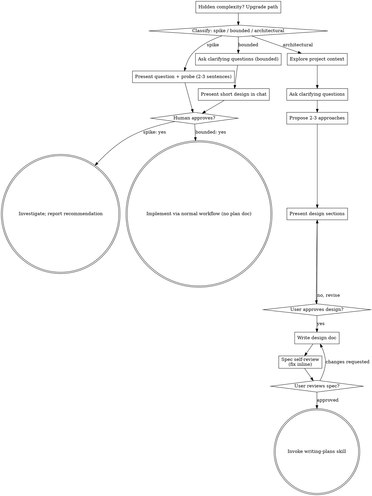

# 把创意打磨成设计方案

通过自然、协作的对话，帮助把想法变成完整的设计方案和 spec。

首先对请求需要多少流程进行分类，然后沿着对应路径推进：理解上下文、打磨想法、呈现设计方案，并获得你的人类伙伴的批准。

<HARD-GATE>
在你告知你的人类伙伴你的意图并获得其批准之前，不得调用任何实现类 skill、编写任何代码、搭建任何项目，或采取任何实现动作。这一要求适用于下面每一条路径上的每一个任务——仪式感随任务规模伸缩；审批门槛从不伸缩。
</HARD-GATE>

## 三条路径

在问第一个问题之前，先对请求进行分类，并大声说出分类结果——例如"这看起来范围明确，所以我将在这里给出一个简短的设计，而不是写 spec"——这样你的人类伙伴可以否决它：

- **Spike**（可行性验证）——一个可行性问题（"我们能不能……"、"这有可能吗……"、"快速搞定就行"），其产出是一个答案，而不是你会保留的代码。用 2-3 句话呈现问题和你要尝试的方向，得到认可后，以正确性允许的最低成本去验证。不写设计文档，不写 spec 文件。把发现以建议的形式汇报；你构建的任何东西都保持"一次性"的标注。
- **Bounded**（范围明确）——对仓库中已存在代码的、范围界定良好的改动：一个新 flag、一个小接口、一处单文件的修复。理解应用的类型还不够——bounded 意味着你要改的流程已经在这里、可以阅读。如果没有可改的既有流程，那这个任务就不是 bounded。提出关键的澄清问题，在聊天中呈现一个简短的设计（几句话到几段话），然后停止。只有在你的人类伙伴对该设计说"是"之后才能开始实现——bounded 任务的批准和架构性任务的批准一样是硬性门槛。不写 spec 文件，不写实现计划文档。
- **Architectural**（架构性）——新项目、新子系统、重组组件关系或改动他人所依赖接口的变更。遵循完整流程：提问、方案、分节设计、书面 spec，然后是 writing-plans 技能。

当对两条路径拿不定主意时，选择更重的那一条。棘轮是单向的：任务中途发现的隐藏复杂度会升级路径——停下来、说出来、向上走。任务中途没有任何东西会降级路径。

## 反模式："简单到不需要批准"

每条路径都以你的人类伙伴在实现前批准你的意图作为结束。一张待办清单、一个单函数工具、一处配置改动——设计可能只是聊天里的两句话，但你必须呈现它并获得批准。"简单"的任务正是未经审视的假设造成最多浪费的地方。随简单性伸缩的是产出物，绝不是审批。

## 红旗

| 想法 | 现实 |
|---------|---------|
| "这太简单了，不需要设计" | 简单意味着短设计，不是没设计。聊天里两句话，然后批准。 |
| "我把它称作 bounded 并跳过 spec" | 为了跳过工作而贴标签本身就是疑虑——选择更重的路径。 |
| "它是 bounded 的，设计也显而易见——他们读的时候我就开始干" | 门槛是批准，不是设计的长度。呈现，然后停下来，直到听到"是"。 |
| "我了解这类应用，所以它是 bounded" | Bounded 衡量的是仓库，不是你的熟悉程度。新项目没有既有流程——它是 architectural。 |
| "Spike 跑通了，所以我保留这些代码" | Spike 的产出是答案。保留代码是一个新请求——对它分类。 |
| "它膨胀了，但我快做完了——没必要重新分类" | 隐藏复杂度会在任务中途升级路径。停下来并说出来。 |
| "他们批准了 spike，所以后续改动也顺带批准了" | 每个任务都有自己的分类和各自的批准。 |

## 清单

先分类，宣布路径，然后为你路径上的每个条目创建任务并按顺序完成。

**Spike:**
1. **探索项目上下文** ——足够用来框定试探方向
2. **呈现问题 + 试探计划** ——2-3 句话
3. **获得批准** ——点头就够了
4. **调查** ——以正确性允许的最低成本进行
5. **汇报发现** ——一个建议；把构建出的任何东西标注为一次性

**Bounded:**
1. **探索项目上下文** ——检查文件、文档、最近的提交
2. **提出澄清问题** ——一次一个，只问关键的问题
3. **在聊天中呈现简短设计** ——方案、涉及的文件、测试
4. **获得批准** ——停止并等待明确的"是"；呈现设计的同时立刻开工等于跳过门槛
5. **实现** ——按正常开发流程推进（适用 TDD）；不写计划文档

**Architectural:**
1. **探索项目上下文** ——检查文件、文档、最近的提交
2. **适时提供视觉伴侣** ——不是一开始就提供。第一次出现"用图展示比用文字描述更清楚"的问题时，届时再提供（用一条独立消息）；批准后它的浏览器标签页为你打开。如果从未出现视觉问题，就永远不要提供。参见下面的"视觉伴侣"一节。
3. **提出澄清问题** ——一次一个，理解目的/约束/成功标准
4. **提出 2-3 个方案** ——附带权衡和你推荐的选项
5. **呈现设计** ——按复杂度分节呈现，每节之后获得用户批准
6. **写设计文档** ——保存到 `docs/superpowers/specs/YYYY-MM-DD-<topic>-design.md` 并提交
7. **Spec 自审** ——快速内联检查占位符、矛盾、歧义、范围（见下文）
8. **用户审阅书面 spec** ——请用户在继续之前审阅 spec 文件
9. **过渡到实现** ——调用 writing-plans 技能创建实现计划

## 流程

**终态与路径绑定。** Architectural：brainstorming 之后你唯一能调用的技能是 writing-plans——绝不是 frontend-design、mcp-builder 或其他任何实现类技能。Bounded：批准后，实现直接通过正常开发流程推进；不写计划文档。Spike：终态是一份汇报出来的建议。

## 流程细则

下面的小节服务于 bounded 和 architectural 两条路径（spike 到"呈现试探、得到点头"就结束）。从 **探索方案** 起的各节是 architectural 路径的深度——对于 bounded 工作，上下文加几个问题再加一段简短聊内设计就是全部流程。

**理解想法：**

- 先查看当前项目状态（文件、文档、最近的提交）
- 在提出细节问题之前先评估范围：如果请求描述了多个相互独立的子系统（例如"构建一个包含聊天、文件存储、计费和分析功能的平台"），立即指出这一点。不要浪费问题去打磨一个需要先拆解的项目中的细节。
- 如果项目大到无法用一个 spec 覆盖，帮助用户拆解为子项目：独立的部件有哪些、它们如何关联、应该按什么顺序构建？然后按正常设计流程先为第一个子项目做头脑风暴。每个子项目都有自己的 spec → plan → 实现循环。
- 对于范围合适的项目，一次一个问题来打磨想法
- 尽可能优先使用多选题，但开放性问题也可以
- 每条消息只问一个问题——如果某个主题需要更多探索，把它拆成多个问题
- 聚焦于理解：目的、约束、成功标准

**探索方案：**

- 提出 2-3 个附带权衡的不同方案
- 以对话方式呈现选项，并附上你的推荐和理由
- 先说推荐的选项并解释原因
- 严格贯彻 YAGNI——从每个方案和设计中删除不必要的功能

**呈现设计：**

- 一旦你相信自己理解了要构建什么，就呈现设计
- 每个小节按复杂度伸缩：直截了当就几句话，微妙复杂则最多 200-300 词
- 每个小节之后询问到目前为止看起来是否合适
- 覆盖：架构、组件、数据流、错误处理、测试
- 如果有地方讲不通，准备好回头澄清

**为隔离与清晰而设计：**

- 把系统拆成更小的单元，每个单元有一个清晰的用途，通过定义良好的接口通信，并能被独立理解和测试
- 对每个单元，你应该能回答：它做什么、怎么用、它依赖什么？
- 别人能不能不读内部实现就理解一个单元是做什么的？你能不能在不断掉使用者的情况下改动内部实现？如果不能，边界需要调整。
- 更小、边界清晰的单元也让你更好处理——你能更好地推理一次能装进上下文的代码，文件聚焦时你的编辑也更可靠。当一个文件变大时，往往就是它做得太多的信号。

**在既有代码库中工作：**

- 在提出改动之前先探索当前结构。遵循既有模式。
- 如果既有代码存在影响当前工作的缺陷（例如一个长得过大的文件、不清晰的边界、纠缠不清的职责），把有针对性的改进纳入设计——就像优秀开发者在他们正在工作的代码中做的那样。
- 不要提议无关的重构。保持聚焦于服务于当前目标的东西。

## 设计之后（architectural 路径）

**文档：**

- 把经过验证的设计（spec）写到 `docs/superpowers/specs/YYYY-MM-DD-<topic>-design.md`
  - （用户对 spec 存放位置的偏好优先于这个默认值）
- 如果可用，使用 elements-of-style:writing-clearly-and-concisely 技能
- 把设计文档提交到 git

**Spec 自审：**
写完 spec 文档后，用全新的眼光看它：

1. **占位符扫描：** 有没有 "TBD"、"TODO"、未完成的小节或含糊的需求？修掉它们。
2. **内部一致性：** 有没有小节相互矛盾？架构是否与功能描述匹配？
3. **范围检查：** 这个规模是否足够聚焦到单个实现计划，还是需要拆解？
4. **歧义检查：** 有没有任何需求可以被两种不同方式解读？如果有，选一种并写明确。

就地修复任何问题。无需重新审阅——修完继续前进。

**用户审阅门槛：**
在 spec 审阅循环通过之后，请用户在继续之前审阅已写好的 spec：

> "Spec 已写好并提交到 `<path>`。请审阅一下，如果你想在我们开始写实现计划之前做任何改动，请告诉我。"

等待用户的回复。如果他们要求改动，做出改动并重新运行 spec 审阅循环。只有用户批准后才继续。

**实现：**

- 调用 writing-plans 技能创建详细的实现计划
- 不要调用任何其他技能。writing-plans 是下一步。

## 视觉伴侣

一个基于浏览器的伴侣，用于在头脑风暴期间展示 mockup、图表和视觉选项。作为一个工具可用——而不是一种模式。接受伴侣意味着它对受益于视觉处理的问题可用；这并不意味着每个问题都走浏览器。

**提供伴侣（适时）：** 不要一开始就提供。等到一个问题确实"用图展示比用文字讲述"更清楚的时候——是真正的 mockup/布局/图表问题，而不仅仅是某个 UI *主题*。第一次出现这种情况时，届时再提供，用一条独立消息：
> "这部分如果我用图展示给你可能更容易——我可以边进行边在浏览器标签页里整理 mockup、图表和对比。它还很新，而且可能比较消耗 token。要我打开吗？我会为你打开它。"

**这个提供必须是独立的消息。** 只有提供本身——不含澄清问题、摘要或其他内容。等待用户的回复。如果他们接受，用 `--open` 启动服务器，这样他们的浏览器会自动打开到第一屏。如果他们拒绝，继续纯文本模式，除非他们主动提起，否则不再提供。

**逐问题决策：** 即使在被用户接受之后，也要针对每个问题决定用浏览器还是终端。判据：**用户用看的会比用读的理解得更好吗？**

- **用浏览器**处理确实属于视觉的内容——mockup、线框图、布局对比、架构图、并排的视觉设计
- **用终端**处理属于文本的内容——需求问题、概念性选择、权衡列表、A/B/C/D 文本选项、范围决策

一个关于 UI 主题的问题不自动是视觉问题。"在这个语境里个性是什么意思？"是概念性问题——用终端。"哪个向导布局效果更好？"是视觉问题——用浏览器。

如果他们同意使用伴侣，在继续之前阅读详细指南：
`skills/brainstorming/visual-companion.md`
