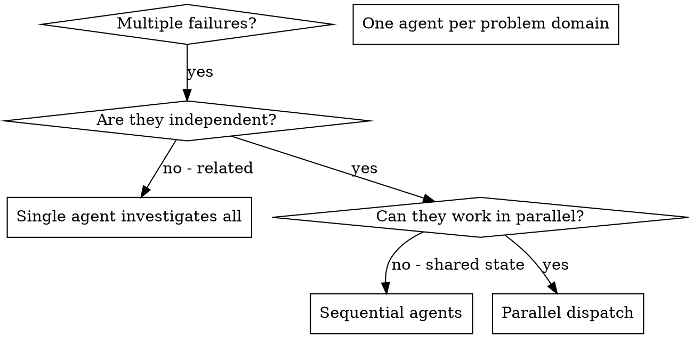

# 并行分派 Agents

## 概述

你将任务委派给拥有隔离上下文的专门化 agents。通过精确构造它们的指令和上下文，你确保它们保持专注并成功完成任务。它们绝不应继承你会话的上下文或历史——由你来构造它们确切需要的内容。这也为你自己的协调工作保留了上下文。

当你有多个互不相关的失败（不同的测试文件、不同的子系统、不同的 bug）时，逐个顺序排查会浪费时间。每次排查都是独立的，可以并行进行。

**核心原则：** 为每个独立的问题领域分派一个 agent。让它们并发工作。

## 何时使用



**适用场景：**
- 3 个以上测试文件因不同根因而失败
- 多个子系统独立损坏
- 每个问题都可以在不借助其他问题上下文的情况下理解
- 各排查之间没有共享状态

**不适用场景：**
- 失败是相关的（修复一个可能修复其他）
- 需要理解完整系统状态
- agents 会互相干扰

## 模式

### 1. 识别独立领域

按损坏的内容对失败进行分组：
- 文件 A 的测试：工具审批流程
- 文件 B 的测试：批量完成行为
- 文件 C 的测试：中止功能

每个领域都是独立的——修复工具审批不会影响中止测试。

### 2. 创建聚焦的 Agent 任务

每个 agent 获得：
- **明确的范围：** 一个测试文件或子系统
- **清晰的目标：** 让这些测试通过
- **约束：** 不要更改其他代码
- **预期输出：** 你所发现和修复内容的总结

### 3. 并行分派

在同一条回复中发出全部三个 subagent 分派——它们会并行运行：

```text
Subagent (general-purpose): "Fix agent-tool-abort.test.ts failures"
Subagent (general-purpose): "Fix batch-completion-behavior.test.ts failures"
Subagent (general-purpose): "Fix tool-approval-race-conditions.test.ts failures"
# All three run concurrently.
```

一条回复中的多个分派调用 = 并行执行。每条回复一个 = 顺序执行。

### 4. 审查与整合

当 agents 返回时：
- 阅读每个总结
- 验证修复不会冲突
- 运行完整测试套件
- 整合所有更改

## Agent Prompt 结构

好的 agent prompt 具备：
1. **聚焦** —— 一个清晰的问题领域
2. **自包含** —— 理解问题所需的全部上下文
3. **输出明确** —— agent 应返回什么？

```markdown
Fix the 3 failing tests in src/agents/agent-tool-abort.test.ts:

1. "should abort tool with partial output capture" - expects 'interrupted at' in message
2. "should handle mixed completed and aborted tools" - fast tool aborted instead of completed
3. "should properly track pendingToolCount" - expects 3 results but gets 0

These are timing/race condition issues. Your task:

1. Read the test file and understand what each test verifies
2. Identify root cause - timing issues or actual bugs?
3. Fix by:
   - Replacing arbitrary timeouts with event-based waiting
   - Fixing bugs in abort implementation if found
   - Adjusting test expectations if testing changed behavior

Do NOT just increase timeouts - find the real issue.

Return: Summary of what you found and what you fixed.
```

## 常见错误

**❌ 过于宽泛：** "修复所有测试" —— agent 会迷失方向
**✅ 具体：** "修复 agent-tool-abort.test.ts" —— 聚焦的范围

**❌ 没有上下文：** "修复竞态条件" —— agent 不知道在哪里
**✅ 提供上下文：** 粘贴错误消息和测试名称

**❌ 没有约束：** agent 可能会重构所有内容
**✅ 设置约束：** "不要更改生产代码" 或 "仅修复测试"

**❌ 输出含糊：** "修复它" —— 你不知道改了什么
**✅ 明确：** "返回根因和更改的总结"

## 何时不使用

**相关失败：** 修复一个可能修复其他——先一起排查
**需要完整上下文：** 理解需要看到整个系统
**探索性调试：** 你还不知道什么坏了
**共享状态：** agents 会互相干扰（编辑相同文件、使用相同资源）

## 会话中的真实示例

**场景：** 重大重构后 3 个文件中共有 6 个测试失败

**失败：**
- agent-tool-abort.test.ts：3 个失败（时序问题）
- batch-completion-behavior.test.ts：2 个失败（工具未执行）
- tool-approval-race-conditions.test.ts：1 个失败（执行次数 = 0）

**决策：** 独立领域——中止逻辑、批量完成、竞态条件三者相互独立

**分派：**
```
Agent 1 → Fix agent-tool-abort.test.ts
Agent 2 → Fix batch-completion-behavior.test.ts
Agent 3 → Fix tool-approval-race-conditions.test.ts
```

**结果：**
- Agent 1：将超时替换为基于事件的等待
- Agent 2：修复了事件结构 bug（threadId 位置错误）
- Agent 3：添加了对异步工具执行完成的等待

**整合：** 所有修复相互独立，无冲突，完整测试套件全绿

## 验证

当 agents 返回后：
1. **审查每个总结** —— 了解改了什么
2. **检查冲突** —— agents 是否编辑了相同代码？
3. **运行完整套件** —— 验证所有修复能协同工作
4. **抽查** —— agents 可能犯系统性错误
