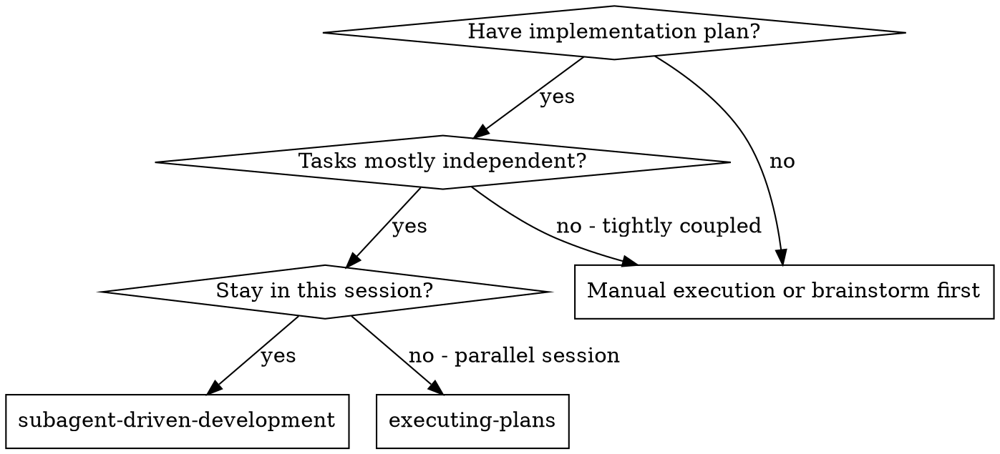
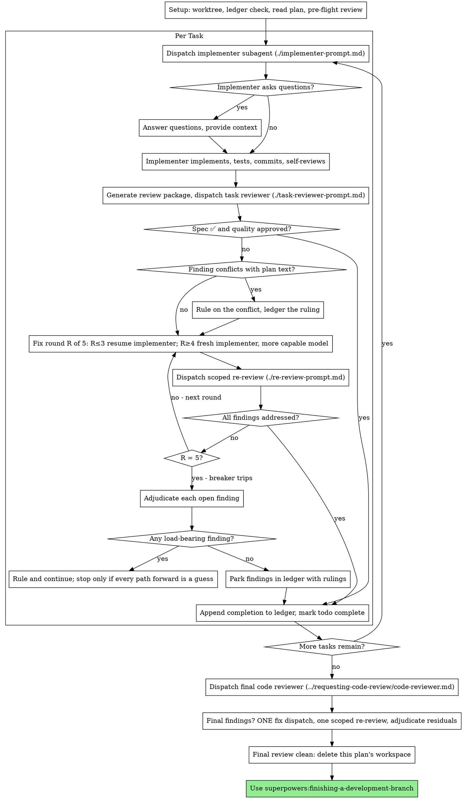

# Subagent 驱动的开发

通过为每个任务分派一个全新的 implementer subagent、在每个任务之后进行一次任务审查（规范符合性 + 代码质量）、并在最后进行一次全面的全分支审查来执行计划。

**为什么使用 subagent：** 你将任务委派给拥有隔离上下文的专门代理。通过精确地构造它们的指令和上下文，你确保它们保持专注并成功完成任务。它们绝不应继承你会话的上下文或历史 —— 你只构建它们恰好需要的内容。这也为你自己保留了用于协调工作的上下文。

**核心原则：** 每个任务使用全新 subagent + 任务审查（规范 + 质量）+ 全面最终审查 = 高质量、快速迭代

**叙述：** 在工具调用之间，最多叙述一行简短的文字 —— 账本和工具结果承载着记录。

**持续执行：** 不要在任务之间停下来与你的人类伙伴确认。不间断地执行计划中的所有任务。唯一的停止原因只有下面列出的四种，或者所有任务都已完成。"我该继续吗？"之类的提示和进度总结浪费他们的时间 —— 他们让你执行计划，那你就去执行。

**做裁决，而不是停滞。** 正在运行的计划不会等待人类。冲突、歧义、计划缺陷、你会想要请求突破的上限 —— 自己决定。规范是约束性权威，计划是它的论证，而你的判断解决两者都没有回答的问题。把每个决定记录在账本中，格式为 `Ruling: <你决定了什么> — <为什么> — <如果错了要付出什么代价>`，然后继续前进。一个错误的裁决带来的返工，你的人类伙伴能看到也能撤销；而一个停在问题上的会话会浪费他们一整天，且毫无所得。

只有四件事会让你停下，且只有这四件：不可逆或破坏性的操作；涉及安全敏感的操作；超出本 worktree 的、按规范应事先询问的副作用（一次合并、推送到共享分支、一次发布）；以及一个糟糕到每条前进路径都只是猜测的计划。遇到这些情况，停下来询问。

## 何时使用



**vs. 执行计划（并行会话）：**
- 同一会话（无上下文切换）
- 每个任务全新 subagent（无上下文污染）
- 每个任务之后进行审查（规范符合性 + 代码质量），最后进行全面审查
- 迭代更快（任务之间无需人类介入）

## 流程



## 准备

确保工作在隔离的工作空间中完成：使用 superpowers:using-git-worktrees 创建一个，或验证现有的一个。未经人类伙伴明确同意，绝不在 main/master 分支上开始实现。

对话记忆无法在压缩（compaction）后存活。在真实会话中，失去位置的 controller 曾重新分派过整个已完成的任务序列 —— 这是观察到的代价最高的单一故障。要把进度记录在账本文件中，而不是只记在 todo 里。

- 每个计划拥有一个工作空间：在技能开始时，运行本技能的 `scripts/sdd-workspace PLAN_FILE` —— 它会打印该计划的 git 忽略目录（`<repo-root>/.superpowers/sdd/<plan-basename>/`），这是本计划所有产物的所在：账本、简报、报告、审查包。另一个计划的目录永远不属于你，不要去读写。
- 在 `<workspace>/progress.md` 检查本计划的账本。如果它的第一行提到了你的计划文件，那么带 `Task <N>: complete` 行的任务都已完成 —— 不要重新分派它们；从第一个没有该行的任务继续。最后一行是修复轮次的任务处于循环中：从下一轮继续循环。第一行提到其他计划文件的账本 —— 或者位于旧的平铺路径 `.superpowers/sdd/progress.md` 的游离账本 —— 是另一个计划的进度：原样保留它，自己重新开始。
- 创建账本，第一行写明其身份：`# SDD ledger — plan: <计划文件路径>`。
- 账本是你的恢复地图：它提到的提交在 git 中真实存在，即使你的上下文已不记得创建过它们。压缩之后，相信账本和 `git log`，而不是你自己的记忆。
- `git clean -fdx` 会销毁工作空间（它是被 git 忽略的临时文件）；如果发生这种情况，从 `git log` 恢复。

通读计划一遍，记下其上下文和全局约束，并为每个任务创建一个 todo。如果计划提到了规范（Spec），也读一下：规范是计划据以论证的权威，计划内部的冲突要对照它来解决。没有可达规范的计划要在账本里加一条说明 —— 在没有规范的情况下做出的裁决都是临时的。

在分派任务 1 之前，通读计划一遍寻找冲突，边查边写下你检查的内容：

- 相互矛盾、或与计划全局约束矛盾的任务
- 计划明确要求、但审查准则视为缺陷的任何内容（断言了什么的测试、逻辑块的逐字重复）

扫描的输出是一张表，而不是一份判决。对于每一对共享文件或接口的任务，各占一行：这两个任务、一个产生的产出对照另一个消费的输入、以及你发现了什么。对于每个任务，各占一行：其自身文本是否自洽 —— 它规定的测试对照它规定的代码，它创建的文件对照它之后要改动的文件。"扫描干净"若没有这些行，就不算你执行过扫描。

把表写入账本。在执行开始之前对你发现的一切做出裁决 —— 每一条发现都对照强制要求它的计划文本 —— 并把每条裁决记录在账本里。如果扫描是干净的，无需评论直接继续。对扫描暴露出的每个冲突做出裁决 —— 规范是约束性权威，计划是它的论证 —— 把裁决记录在其所在行旁边，然后分派任务 1。审查循环仍然是那些只有从实现中才会浮现的冲突的兜底。

## 模型选择

使用能胜任每个角色的、尽量低配的模型，以节省成本并提高速度。

**机械性的实现任务**（隔离的函数、清晰的规范、1-2 个文件）：使用快速、廉价的模型。当计划被良好规定时，大多数实现任务都是机械性的。

**集成与判断类任务**（多文件协调、模式匹配、调试）：使用标准模型。

**架构与设计类任务**：使用当前可用的最强模型。最终的全分支审查就属于这一类 —— 用当前可用的最强模型分派它，而不是会话默认模型。

**审查类任务**：选择具备同样判断力、且规模匹配 diff 的大小、复杂度与风险的模型。小的机械性 diff 不需要最强模型；细微的并发改动则需要。对小的修复 diff 做限定范围的复审，用廉价到中档的层级即可。

**修复循环的升级（第 4-5 轮）**：使用至少比卡住的 implementer 高一档的模型。

**分派 subagent 时始终显式指定模型。** 省略模型会继承你会话的模型 —— 通常是最强也最贵的 —— 从而默默抵消本节的用意。

**轮次数量比 token 价格更重要。** 墙钟时间和上下文成本与 subagent 耗费的轮次成正比，而最廉价的模型在多步工作上通常要多花 2-3 倍的轮次 —— 总成本反而更高。reviewer 以及根据散文式描述工作的 implementer，最低用中档模型。当任务的计划文本已包含要写的完整代码时，实现就是转录加测试：这类 implementer 用最廉价的一档。单文件机械性修复也采用最廉价的一档。

**任务复杂度信号（实现类任务）：**
- 只涉及 1-2 个文件且有完整规范 → 廉价模型
- 涉及多个文件且有集成问题 → 标准模型
- 需要设计判断或广泛的代码库理解 → 最强模型

## 任务循环

**把小的同类工作批量处理。** 当计划列出若干个同属一种小型独立编辑的任务 —— 同样的单行修复、常量改动或字段添加在多文件间重复 —— 不要每个任务分派一个 subagent。拼装成一份分派简报，列出每个文件及其改动，把整批交给一个 subagent，并把它的 diff 作为一个整体审查。只有在工作需要独立判断、独立测试或独立审查面时，才保留一个任务一次分派的做法。

你粘贴进分派提示的所有内容 —— 以及 subagent 打印回来的一切 —— 都会在你会话的剩余时间里驻留在你的上下文中，并在之后的每一轮被重新读取。把产物作为文件传递。

**等待已分派的 subagent：** 绝不用短超时轮询等待接口，也绝不陷在某个无声的、无期限的等待里。当你还有本地工作 —— 更新账本、打包下一次审查、阅读报告 —— 就继续干活；子进程的结果会自行到达。当你真正空闲时，以有界的时段等待（在你的平台允许时，五到十分钟），并在时段之间发布一行状态、核对你的活跃子进程：列出它们，并追查任何已完成却没有报告的。有界的时段能保住长时间等待的几乎全部效率，同时保证卡住或丢失的子进程在几分钟内（而不是在会话结束时）就被注意到。

### 1. 分派 implementer

在分派前记录 BASE（`git rev-parse HEAD`）—— 审查包和修复轮次的 diff 都需要它。

- **任务简报：** 在分派 implementer 之前，运行本技能的 `scripts/task-brief PLAN_FILE N` —— 它把任务的完整文本抽取到唯一命名的文件中并打印其路径。组织分派，让简报始终是需求的唯一来源。你的分派应包含：(1) 一行说明此任务在项目中的位置；(2) 简报路径，以"先读这个 —— 这是你的需求，其中的精确值要逐字使用"来引出；(3) 简报不可能知道的、来自更早任务的接口与决定；(4) 你注意到的简报中的任何歧义的处理；(5) 报告文件路径和报告契约。精确值（数字、魔法字符串、签名、测试用例）只出现在简报里。绝不让 subagent 读取整个计划文件。
- **报告文件：** 以简报命名 implementer 的报告文件（简报 `…/task-N-brief.md` → 报告 `…/task-N-report.md`），并把它写进分派提示。implementer 在那里写完整报告，只返回状态、提交、一行测试总结和关切。
- 分派提示描述一个任务，而不是会话的历史。不要把累积的先前任务总结（"任务 1-3 之后的状态"）粘贴进后来的分派 —— 某次真实会话的分派达到了 42k 字符，其中 99% 是粘贴的历史。一个全新的 subagent 需要它的任务、它触及的接口和全局约束。仅此而已。
- 分派携带不派生子进程契约（它在 implementer 模板里）：implementer 绝不分派 subagent —— 既不派帮手，也绝不派 reviewer。审查由你在报告之后提供。在真实会话中，每个由 worker 派生的 reviewer 都重复了 controller 本来就会分派的任务审查 —— 每个任务多出一个完整的审查席位。
- 如果更早的任务在本任务涉及的领域停放了发现，在分派中带上指向该账本条目的指针。
- 从分派结果记录 implementer 的代理身份 —— 修复循环的第 1-3 轮要恢复这个代理。
- 绝不要并行分派多个实现 subagent（会冲突）。

模板：[implementer-prompt.md](implementer-prompt.md)

### 2. 处理报告

Implementer subagent 会报告四种状态之一。分别恰当处理：

**DONE：** 生成审查包（`scripts/review-package PLAN_FILE BASE HEAD`，从本技能目录运行 —— 它会打印其写出的唯一文件路径；BASE 是你分派 implementer 前记录的提交 —— 绝不用 `HEAD~1`，那会静默丢掉多提交任务里除最后一个提交外的所有提交），然后用打印出的路径分派任务 reviewer。

**DONE_WITH_CONCERNS：** Implementer 完成了工作，但标记了疑虑。在继续之前阅读这些关切。如果关切涉及正确性或范围，在审查前处理它们。如果只是观察（例如"这个文件越来越大了"），记下它们然后进入审查。

**NEEDS_CONTEXT：** Implementer 需要未提供的信息。提供缺失的上下文并重新分派。

**BLOCKED：** Implementer 无法完成任务。评估阻塞原因：
1. 如果是上下文问题，提供更多上下文并用同一模型重新分派
2. 如果任务需要更多推理，用更强的模型重新分派
3. 如果任务太大，把它拆成更小的块
4. 如果计划本身错了，裁决更正、记入账本，并把裁决带在分派中重新分派

**绝不**忽略一次升级，或强迫同一模型在毫无改变的情况下重试。如果 implementer 说它卡住了，就需要有所改变。

如果 implementer 提问 —— 无论是开始前还是任务中途 —— 清晰完整地回答，必要时提供更多上下文，并且不要催促它进入实现。

### 3. 审查任务

每个任务的审查都是任务范围的关卡。全面审查只在最后的全分支审查时进行一次。绝不跳过任务审查，也绝不接受缺少任一裁决的报告 —— 规范符合性 AND 任务质量两者都必需。Implementer 的自我审查永远不能替代任务审查；两者都需要。

- 把它的 diff 作为文件交给 reviewer：运行本技能的 `scripts/review-package PLAN_FILE BASE HEAD`，并把其打印的文件路径传给 reviewer（没有 bash 时：对目标范围执行 `git log --oneline`、`git diff --stat` 和 `git diff -U10`，重定向到一个唯一命名的文件）。输出绝不进入你自己的上下文，reviewer 通过一次 Read 调用就能看到提交列表、统计摘要和带上下文的完整 diff。使用你分派 implementer 前记录的 BASE —— 绝不用 `HEAD~1`，那会静默截断多提交任务。绝不在没有 diff 文件的情况下分派任务 reviewer。
- **Reviewer 输入：** 任务 reviewer 得到三个路径 —— 同一份简报文件、报告文件和审查包 —— 外加约束本任务的全局约束。
- 你交给 reviewer 的全局约束块就是它的注意力透镜。把计划全局约束一节或规范中的约束性要求逐字复制过来：精确值、精确格式，以及组件之间明确陈述的关系（"与 X 布局相同"、"匹配 Y"）。Reviewer 的模板已携带流程规则（YAGNI、测试卫生、审查方法）—— 约束块是给本项目的规范所要求的那些内容。
- 不要添加开放式指令，比如"检查所有用法"或"如有用可运行竞态测试"，除非有具体、与任务相关的理由。
- 不要让 reviewer 重新运行 implementer 已在同一份代码上运行过的测试 —— implementer 的报告承载着测试证据。
- 不要替 reviewer 预判发现 —— 绝不要指示 reviewer 忽略或不标记某个具体问题。如果你认为某条发现会是误报，让 reviewer 提出它，并在审查循环中裁决它。如果你正在写的提示里含有"不要标记"、"不要把 X 当作缺陷"、"至多 Minor"或"计划选择了"—— 停下来：你正在预判，通常是为了给自己省一次审查循环。
任务 reviewer 可能报告"⚠️ 无法仅凭 diff 验证"项 —— 即存在于未改动代码中或跨任务的需求。它们不阻塞其余审查，但在标记任务完成之前，你必须自己逐条解决它们：你掌握着 reviewer 缺少的计划和跨任务上下文。如果你确认某条确实是真实缺口，就把它当作一次失败的规范审查 —— 它带着其他发现一起进入修复循环。

模板：[task-reviewer-prompt.md](task-reviewer-prompt.md)

### 4. 修复循环

当审查报告规范 ❌、任何 Critical 或 Important 发现、或你确认是真实缺口的 ⚠️ 项时，循环触发。

在循环开始前，有两条出路可以立即离开它：

- 随时把 Minor 发现记录到进度账本里（`Task <N>: minor (deferred): <一行>`），并把最终的全分支审查指向该清单，以便它分诊哪些必须在合并前修复。一份无人阅读的汇总就是一次静默丢弃。Minor 发现绝不进入循环。
- 标记为 plan-mandated 的发现 —— 或任何与计划文本要求相冲突的发现 —— 由你裁决：把发现与计划文本权衡，以规范为约束性权威做决定，并在付诸行动前把裁决记入账本。不要因为计划强制要求它就把发现一扔了之，也不要在没有记录裁决的情况下分派与计划相矛盾的修复。
其余一切进入循环。一个修复轮次 = 一次修复分派 + 一次限定范围的复审。每个任务最多五轮：

**第 1-3 轮 —— 恢复原 implementer。** 把未决发现逐字发给它。它的上下文完好：它知道任务、代码和自己的选择。如果你的 harness 无法向一个存活的 subagent 发送另一条消息，就分派一个携带简报路径、报告文件路径和发现的全新 implementer —— 无论哪种方式，报告文件都是持久记忆。

**第 4-5 轮 —— 在更强的模型上分派全新 implementer**（按模型选择），携带简报路径、报告文件路径、未决发现，以及这样的框架："一位先前的 implementer 尝试过此任务 [N] 次；现在它归你所有。阅读报告文件了解尝试过什么。"一个挺过了三次恢复的循环，通常意味着 implementer 看不到自己的问题 —— 新视角和一次能力提升，一步到位。

**每一轮，无论哪种方式：** implementer 修复、重新运行覆盖已修改代码的测试、把修复报告追加到同一份报告文件中，并返回那份简短的契约。在重新分派 reviewer 之前，确认修复报告包含覆盖性测试、运行的命令和输出；三者齐备后再分派复审。在修复消息中点名覆盖性测试文件 —— 一行修复不需要整套测试套件。

**复审是限定范围的。** 运行 `scripts/review-package PLAN_FILE FIX_BASE HEAD`，其中 FIX_BASE 是上一轮审查看到的 head，并用发现清单、简报、报告文件和打印出的 diff 路径分派 [re-review-prompt.md](re-review-prompt.md)。复审者对每条发现判定 ADDRESSED 或 NOT ADDRESSED，并且只标记修复 diff 中的新破坏。修复 diff 中新的 Critical/Important 破坏会加入未决发现清单。范围外的观察作为延后 Minor 进入账本 —— 它们绝不让循环延长。

**每一轮之后，** 在账本里追加：`Task <N>: fix round <R>/5 (<X> addressed, <Y> open — <finding one-liners>; commits <a7>..<b7>)`

绝不在 controller 会话里自己修发现 —— 你的上下文要留给协调保持干净，而且 controller 的修复会跳过审查。

**熔断器。** 当第 5 轮的复审仍留有未决发现时，停止分派。自己裁决每一条未决发现 —— 你掌握着 reviewer 缺少的计划和跨任务上下文：

- **Reviewer 错了，或该观点有争议：** 停放它 —— `Task <N>: parked — <finding> — Ruling: <代码为什么成立>`。最终审查会看到双方。
- **属实，但没有下游依赖它：** 同样停放它，裁决说明它属实且已延后。
- **属实且承重** —— 后面的任务要建立在它之上，或它暴露了计划缺陷：裁决能让依赖工作解除阻塞的最小改动，记为 `Task <N>: Ruling: <finding> — <你决定了什么以及为什么>`，并把它带进下一个任务的分派。静默停放一个结构性失败，会让每个依赖任务都建立在它之上。只有当缺陷让每条前进路径都变成猜测时，才停下来。

只在达到上限时裁决。提前裁决以结束循环，是换了个名字的预判。每一次裁决都是一条账本条目 —— 静默丢弃是被禁止的。

### 5. 完成任务

当审查干净返回 —— 或每条未决发现都在上限处带着裁决被停放 —— 在同一消息中随其他簿记一起向账本追加完成行：

- `Task <N>: complete (commits <base7>..<head7>, review clean)`
- `Task <N>: complete (commits <base7>..<head7>, <K> parked)` —— 在熔断器跳闸之后

然后标记 todo 完成并继续。当审查仍有既未修复、也未在上限处带裁决停放的未决 Critical/Important 问题时，绝不进入下一个任务。

## 最终审查

最终的全分支审查也要一个包：运行 `scripts/review-package PLAN_FILE MERGE_BASE HEAD`（MERGE_BASE = 分支开始的提交，例如 `git merge-base main HEAD`），并把打印出的路径放进最终审查分派，这样最终 reviewer 读一个文件即可，不必用 git 命令重新推导分支 diff。用当前可用的最强模型分派（见模型选择），使用 superpowers:requesting-code-review 的 [code-reviewer.md](../requesting-code-review/code-reviewer.md)。把账本中的延后 Minor 行和停放行指给它，以便它分诊哪些必须在合并前修复。

如果最终全分支审查返回发现，用一个携带完整发现清单的修复 subagent 分派一次修复 —— 而不是每条发现一个修复者。逐条发现的修复者各自重建上下文并重新运行测试套件；某次真实会话中，最终审查的修复波成本超过了其所有任务的总和。然后对修复波恰好运行一次限定范围的复审（对修复范围执行 `scripts/review-package PLAN_FILE FIX_BASE HEAD`，用 [re-review-prompt.md](re-review-prompt.md)）。对任何残余发现按任务循环熔断器的方式裁决：带裁决停放，或裁决承重的那些并记录你的决定。只有上面四类才会在此停下你。不会有第二次修复波 —— 残余的承重发现会在 finishing-a-development-branch 呈现选项时浮现给你的人类伙伴。

## 收尾

在删除任何东西之前，收集账本中所有含 `Ruling:` 的行 —— 预检裁决、停放的发现、熔断器裁决，全部 —— 放进你的最终消息"我做过的裁决"一节，按你做出它们的顺序，每条都注明如果错了要付出什么代价。这份清单是穷尽的：只要账本里有一条裁决，清单里就有它。这份清单是你代人类伙伴做出的决定抵达他们的唯一途径 —— 他们读到它，并返工你做错的任何部分。随工作空间一同湮灭的裁决，就是秘密做出的决定。

当最终全分支审查干净且其修复已合并时，删除本计划的工作空间（`rm -rf <workspace>`）—— 现在记录在 git 历史里了。兄弟目录属于其他计划；别碰它们。

使用 superpowers:finishing-a-development-branch。

## 常见合理化借口

| 借口 | 现实 |
|--------|---------|
| "规范符合性差不多就行" | Reviewer 发现了规范差距 = 未完成。修复，或达到上限后裁决 —— 那是仅有的两条出路。 |
| "我自己修好了，分派是额外开销" | Controller 的修复会污染你的上下文并跳过审查。恢复 implementer。 |
| "再来一轮就会收敛" | 过了上限，轮次不会收敛 —— 失败是结构性的。裁决并改道。 |
| "反正 reviewer 还会发现新的东西" | 限定范围的复审只验证修复；它们不会跑偏。未改动代码上的新发现进账本，不进循环。 |
| "这条发现显然错了，我丢掉它" | 你只在达到上限时裁决，而每条裁决都是账本条目。静默丢弃是被禁止的。 |
| "修复很小，跳过复审" | 未经审查的修复正是回归落地的途径。每一轮都以限定范围的复审收尾。 |
| "审查拖慢了循环" | 没有审查的循环只是未经核实的空转。审查是循环的刹车和方向盘。 |
| "账本簿记是额外开销" | 账本正是能在压缩后存活的东西。没有账本的 controller 曾重新分派过整个已完成的任务序列。 |
| "Implementer 派了自己的 reviewer —— 免费的额外保障" | 那是在审查同一份 diff 的重复席位；任务审查才是关卡。worker 派生的 reviewer 是要标记的缺陷，不是严谨性。 |

## 示例工作流

```
You: I'm using Subagent-Driven Development to execute this plan.

[Setup: worktree verified]
[Read plan file once: docs/superpowers/plans/feature-plan.md]
[Resolve workspace: scripts/sdd-workspace docs/superpowers/plans/feature-plan.md — no ledger inside, fresh start]
[Create todos for all tasks]

Task 1: Hook installation script

[Run task-brief for Task 1; dispatch implementer with brief + report paths + context]

Implementer: "Before I begin - should the hook be installed at user or system level?"

You: "User level (~/.config/superpowers/hooks/)"

Implementer: [Later]
  - Implemented install-hook command
  - Added tests, 5/5 passing
  - Self-review: Found I missed --force flag, added it
  - Committed

[Run review-package PLAN_FILE BASE HEAD; dispatch task reviewer with the printed path]
Task reviewer: Spec ✅ - all requirements met, nothing extra.
  Strengths: Good test coverage, clean. Issues: None. Task quality: Approved.

[Ledger: Task 1: complete (commits a1b2c3d..d4e5f6a, review clean)]

Task 2: Recovery modes

[Run task-brief for Task 2; dispatch implementer with brief + report paths + context]

Implementer: [No questions]
  - Added verify/repair modes
  - 8/8 tests passing
  - Committed

[Run review-package PLAN_FILE BASE HEAD; dispatch task reviewer with the printed path]
Task reviewer: Spec ❌:
  - Missing: Progress reporting (spec says "report every 100 items")
  Issues (Important): Magic number (100)

[Fix round 1: resume the implementer with both findings]
Implementer: Added progress reporting, extracted PROGRESS_INTERVAL constant.
  Re-ran test/recovery.test.js — 10/10 passing. Fix report appended.

[Run review-package PLAN_FILE FIX_BASE HEAD; dispatch scoped re-review]
Re-reviewer: Missing progress reporting — ADDRESSED (src/recovery.js:41).
  Magic number — ADDRESSED (src/recovery.js:7). New breakage: none.
  Verdict: all findings addressed.

[Ledger: Task 2: fix round 1/5 (2 addressed, 0 open; commits d4e5f6a..b7c8d9e)]
[Ledger: Task 2: complete (commits d4e5f6a..b7c8d9e, review clean)]

...

[After all tasks]
[Run review-package PLAN_FILE MERGE_BASE HEAD; dispatch final code-reviewer, most capable model]
Final reviewer: All requirements met. Deferred minors triaged: none block merge.

[Delete this plan's workspace — the record now lives in git]

Done! Using superpowers:finishing-a-development-branch.
```
