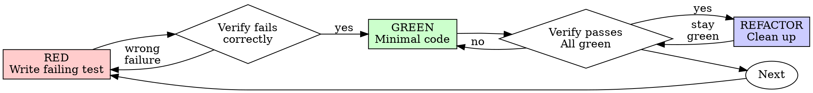

# 测试驱动开发（TDD）

## 概述

先写测试。看着它失败。再写最少的代码让它通过。

**核心原则：** 如果你没有看着测试失败，你就不知道它是否测试了正确的东西。

**违反规则的字面规定就是违反规则的精神。**

## 何时使用

**始终使用：**
- 新功能
- 缺陷修复
- 重构
- 行为变更

**例外情况（询问你的人类伙伴）：**
- 一次性原型
- 生成的代码
- 配置文件

想着"这次就跳过 TDD 吧"？停。那是合理化借口。

## 铁律

```
没有先写失败的测试，就不允许写任何生产代码
```

在测试之前写了代码？删掉它。重新开始。

**没有例外：**
- 不要"留作参考"
- 不要在写测试时"顺便改编"它
- 不要看它
- 删就是删

从测试出发全新实现。没有商量余地。

## 红-绿-重构（RED-GREEN-REFACTOR）



### RED —— 编写失败的测试

写一个最简测试，表明应该发生什么。

<Good>
```typescript
test('retries failed operations 3 times', async () => {
  let attempts = 0;
  const operation = () => {
    attempts++;
    if (attempts < 3) throw new Error('fail');
    return 'success';
  };

  const result = await retryOperation(operation);

  expect(result).toBe('success');
  expect(attempts).toBe(3);
});
```
命名清晰、测试真实行为、只测一件事
</Good>

<Bad>
```typescript
test('retry works', async () => {
  const mock = jest.fn()
    .mockRejectedValueOnce(new Error())
    .mockRejectedValueOnce(new Error())
    .mockResolvedValueOnce('success');
  await retryOperation(mock);
  expect(mock).toHaveBeenCalledTimes(3);
});
```
命名含糊、测试的是 mock 而非真实代码
</Bad>

**要求：**
- 只测一种行为
- 命名清晰
- 使用真实代码（除非万不得已，不使用 mock）

### 验证 RED —— 看着它失败

**强制要求。绝不可跳过。**

```bash
npm test path/to/test.test.ts
```

确认：
- 测试失败（而非报错）
- 失败信息符合预期
- 失败是因为功能缺失（而非拼写错误）

**测试通过了？** 你在测试既有行为。修正测试。

**测试报错了？** 修复错误，重新运行直到它以正确的方式失败。

### GREEN —— 最小代码

写最简单的代码让测试通过。

<Good>
```typescript
async function retryOperation<T>(fn: () => Promise<T>): Promise<T> {
  for (let i = 0; i < 3; i++) {
    try {
      return await fn();
    } catch (e) {
      if (i === 2) throw e;
    }
  }
  throw new Error('unreachable');
}
```
刚好足以通过
</Good>

<Bad>
```typescript
async function retryOperation<T>(
  fn: () => Promise<T>,
  options?: {
    maxRetries?: number;
    backoff?: 'linear' | 'exponential';
    onRetry?: (attempt: number) => void;
  }
): Promise<T> {
  // YAGNI
}
```
过度设计
</Bad>

不要添加功能、不要重构其他代码、不要超出测试范围"改进"。

### 验证 GREEN —— 看着它通过

**强制要求。**

```bash
npm test path/to/test.test.ts
```

确认：
- 测试通过
- 其他测试仍然通过
- 输出干净（无报错、无警告）

**测试失败了？** 修代码，不是修测试。

**其他测试失败了？** 立即修复。

### REFACTOR —— 清理

仅在绿色之后：
- 消除重复
- 改进命名
- 抽取辅助函数

保持测试绿色。不添加行为。

### 重复

为下一个功能写下一个失败的测试。

## 好测试的标准

| 品质 | 好 | 差 |
|---------|------|-----|
| **最小化** | 只测一件事。名字里有"和"？拆开。 | `test('validates email and domain and whitespace')` |
| **清晰** | 名称描述行为 | `test('test1')` |
| **体现意图** | 展示期望的 API | 掩盖了代码应该做什么 |

在编写或修改任何测试时，阅读 [writing-good-tests.md](writing-good-tests.md) 了解让测试保持诚实的规则：
- 先说出"哪个生产变更会让这个测试失败"——在编写之前
- 断言真实行为，绝不断言 mock 行为
- 只供测试使用的代码放在测试工具里，不放进生产类
- 在 mock 依赖之前，先理解它的副作用

## 常见的合理化借口

| 借口 | 现实 |
|--------|---------|
| "太简单，不需要测试" | 简单的代码也会坏。测试只需要 30 秒。 |
| "我之后再测" | 事后写的测试立即通过——这证明不了任何东西。它们可能测错了东西，测的是实现而非行为，或者漏掉了你忘记的边界情况。你从未看着它失败，所以从未证明它能抓住缺陷。测试先行强制你经历那次失败。 |
| "事后测试也能达到同样的目标（重精神而非形式）" | 事后测试回答的是"这段代码做了什么？"；测试先行回答的是"这段代码应该做什么？"。事后写的测试被你已写出的代码带偏——你验证的是你记得的用例，而不是你会发现的用例。有覆盖率，却没有测试有效的证明。 |
| "已经手工测过了" | 手工测试是临时的：没有记录你覆盖了什么，代码变化后无法重跑，压力下容易漏掉用例。"我试过能跑"不等于全面覆盖。自动化测试每次都按同样方式运行。 |
| "删掉已经花掉的 X 小时太浪费" | 沉没成本谬误——那些时间无论怎样都已花掉。真正要选的是：用 TDD 重写（高信心）vs. 保留并事后补测试（低信心、很可能有 bug）。留着你不信任的代码才是浪费。 |
| "留作参考，先写测试" | 你会去改编它。那就是事后测试。删就是删。 |
| "需要先探索一下" | 没问题。把探索成果扔掉，从 TDD 开始。 |
| "难测 = 设计不清晰" | 倾听测试的声音。难测 = 难用。 |
| "TDD 会拖慢我" | TDD 就是务实的路径：在提交前抓住 bug、防止回归、让你毫无恐惧地重构。"务实"的捷径意味着在生产环境调试——更慢，而不是更快。 |
| "手工测试更快" | 手工无法证明边界情况。每次改动你都要重测。 |
| "既有代码没有测试" | 你正在改进它。为既有代码补测试。 |

## 危险信号 —— 停下并重新开始

- 测试之前写代码
- 实现之后再写测试
- 测试立即通过
- 说不清测试为什么会失败
- "稍后"补的测试
- 合理化"就这一次"
- "我已经手工测过了"
- "事后测试也能达到同样的目的"
- "重要的是精神而非形式"
- "留作参考"或"改编既有代码"
- "已经花了 X 小时，删掉太浪费"
- "TDD 太教条，我这是在务实"
- "这次不一样，因为……"

**所有这些都意味着：删除代码。用 TDD 重新开始。**

## 示例：缺陷修复

**缺陷：** 空邮箱被接受

**RED**
```typescript
test('rejects empty email', async () => {
  const result = await submitForm({ email: '' });
  expect(result.error).toBe('Email required');
});
```

**验证 RED**
```bash
$ npm test
FAIL: expected 'Email required', got undefined
```

**GREEN**
```typescript
function submitForm(data: FormData) {
  if (!data.email?.trim()) {
    return { error: 'Email required' };
  }
  // ...
}
```

**验证 GREEN**
```bash
$ npm test
PASS
```

**REFACTOR**
如需要，为多个字段抽取校验逻辑。

## 验证清单

在标记工作完成之前：

- [ ] 每个新函数/方法都有测试
- [ ] 在实现之前看过每个测试失败
- [ ] 每个测试都因预期原因失败（功能缺失，而非拼写错误）
- [ ] 为通过每个测试写了最少的代码
- [ ] 所有测试通过
- [ ] 输出干净（无报错、无警告）
- [ ] 测试使用真实代码（只有万不得已才用 mock）
- [ ] 边界情况和错误已覆盖

有一项没勾上？你跳过了 TDD。重新开始。

## 卡住时怎么办

| 问题 | 解决方案 |
|---------|----------|
| 不知道怎么测 | 写下期望的 API。先写断言。询问你的人类伙伴。 |
| 测试太复杂 | 设计太复杂。简化接口。 |
| 必须 mock 一切 | 代码耦合太紧。使用依赖注入。 |
| 测试搭建太庞大 | 抽取辅助函数。还是复杂？简化设计。 |

## 与调试的集成

发现 bug？写一个复现它的失败测试。遵循 TDD 循环。测试既证明修复有效，又防止回归。

修复 bug 永远不能没有测试。

## 最终规则

```
生产代码 → 已有测试且该测试先失败过
否则 → 不是 TDD
```

未经你的人类伙伴允许，没有例外。
