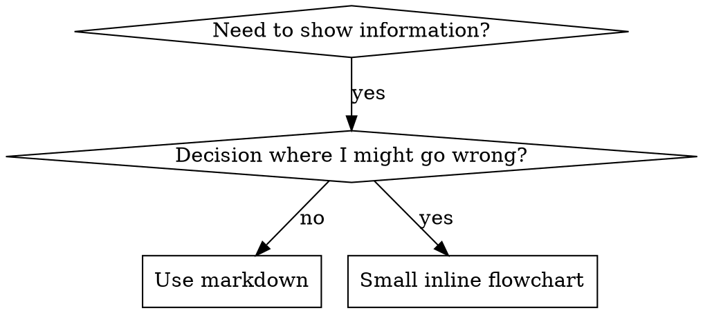

# 编写技能

## 概览

**编写技能就是对流程文档应用测试驱动开发（TDD）。**

**个人技能存放在运行时的技能目录中**（Claude Code 上为 `~/.claude/skills/`）——这些运行时上的路径请参阅 [codex-tools.md](../using-superpowers/references/codex-tools.md) 或 [gemini-tools.md](../using-superpowers/references/gemini-tools.md)。Codex、Copilot CLI 和 Gemini CLI 也都识别 `~/.agents/skills/` 作为跨运行时别名。

你编写测试用例（带有子 agent 的压力场景），观察它们失败（基线行为），编写技能（文档），观察测试通过（agent 遵守），然后重构（堵上漏洞）。

**核心原则：** 如果你没有观察到 agent 在没有技能的情况下失败，你就不知道这个技能是否教会了正确的东西。

**必备背景：** 在使用此技能之前，你必须理解 superpowers:test-driven-development。该技能定义了基本的 RED-GREEN-REFACTOR 循环。本技能将 TDD 应用于文档。

**官方指南：** 关于 Anthropic 官方的技能编写最佳实践，请参阅 anthropic-best-practices.md。本文档提供了与本技能中 TDD 驱动方法相辅相成的额外模式和指南。

## 什么是技能？

**技能**是经过验证的技术、模式或工具的参考指南。技能帮助未来的 agent 发现并应用有效的方法。

**技能是：** 可复用的技术、模式、工具、参考指南

**技能不是：** 关于你如何解决过一次问题的叙述

## 技能的 TDD 映射

| TDD 概念 | 技能创建 |
|-------------|----------------|
| **测试用例** | 带有子 agent 的压力场景 |
| **生产代码** | 技能文档（SKILL.md） |
| **测试失败（RED）** | 没有技能时 agent 违反规则（基线） |
| **测试通过（GREEN）** | 有技能时 agent 遵守规则 |
| **重构** | 在保持遵守的同时堵上漏洞 |
| **先写测试** | 在编写技能之前运行基线场景 |
| **观察失败** | 记录 agent 使用的确切合理化理由 |
| **最小代码** | 编写针对这些具体违规行为的技能 |
| **观察通过** | 验证 agent 现在遵守规则 |
| **重构循环** | 发现新的合理化理由 → 堵漏 → 重新验证 |

整个技能创建过程遵循 RED-GREEN-REFACTOR。

## 何时创建技能

**创建当：**
- 该技术对你来说并非直观明显
- 你会跨项目再次引用它
- 模式适用范围广（非项目特定）
- 其他人会受益

**不要为以下情况创建：**
- 一次性解决方案
- 其他地方已有完善文档的标准实践
- 项目特定约定（放入你的指令文件中）
- 机械性约束（如果可以用 regex/验证来强制执行，就自动化——把文档留给需要判断的情况）

## 技能类型

### 技术
具有可遵循步骤的具体方法（condition-based-waiting、root-cause-tracing）

### 模式
思考问题的方式（flatten-with-flags、test-invariants）

### 参考
API 文档、语法指南、工具文档（office docs）

## 目录结构


```
skills/
  skill-name/
    SKILL.md              # Main reference (required)
    supporting-file.*     # Only if needed
```

**扁平命名空间** - 所有技能位于一个可搜索的命名空间中

**单独文件用于：**
1. **重型参考**（100+ 行）- API 文档、综合语法
2. **可复用工具** - 脚本、工具、模板

**保持内联：**
- 原则和概念
- 代码模式（< 50 行）
- 其他一切

## SKILL.md 结构

**Frontmatter（YAML）：**
- 两个必填字段：`name` 和 `description`（所有受支持字段见 [agentskills.io/specification](https://agentskills.io/specification)）
- 总计最多 1024 个字符
- `name`：只使用字母、数字和连字符（不使用括号、特殊字符）
- `description`：第三人称，只描述何时使用（而不是它做什么）
  - 以 "Use when..." 开头，聚焦于触发条件
  - 包含具体的症状、情况和上下文
  - **绝不总结技能的过程或工作流**（原因见 SDO 章节）
  - 如果可能，保持在 500 字符以内

```markdown
---
name: Skill-Name-With-Hyphens
description: Use when [specific triggering conditions and symptoms]
---

# Skill Name

## Overview
What is this? Core principle in 1-2 sentences.

## When to Use
[Small inline flowchart IF decision non-obvious]

Bullet list with SYMPTOMS and use cases
When NOT to use

## Core Pattern (for techniques/patterns)
Before/after code comparison

## Quick Reference
Table or bullets for scanning common operations

## Implementation
Inline code for simple patterns
Link to file for heavy reference or reusable tools

## Common Mistakes
What goes wrong + fixes

## Real-World Impact (optional)
Concrete results
```


## 技能发现优化（SDO）

**对发现至关重要：** 未来的 agent 需要找到你的技能

### 1. 丰富的描述字段

**目的：** 你的 agent 读取描述以决定为给定任务加载哪些技能。让描述回答："我现在应该读这个技能吗？"

**格式：** 以 "Use when..." 开头，聚焦于触发条件

**关键：描述 = 何时使用，而不是技能做什么**

描述应该只描述触发条件。不要在描述中总结技能的过程或工作流。

**为什么这很重要：** 测试表明，当描述总结了技能的工作流时，agent 可能遵循描述而不是读取完整的技能内容。一个写着 "code review between tasks" 的描述导致 agent 只做了一次审查，尽管技能的流程图清楚地显示需要两次审查（先规格合规，后代码质量）。

当描述改为仅 "Use when executing implementation plans with independent tasks"（没有工作流总结）时，agent 正确地读取了流程图并遵循了两阶段审查过程。

**陷阱：** 总结工作流的描述会创造 agent 会走的捷径。技能正文变成了 agent 跳过的文档。

```yaml
# ❌ BAD: Summarizes workflow - agents may follow this instead of reading skill
description: Use when executing plans - dispatches subagent per task with code review between tasks

# ❌ BAD: Too much process detail
description: Use for TDD - write test first, watch it fail, write minimal code, refactor

# ✅ GOOD: Just triggering conditions, no workflow summary
description: Use when executing implementation plans with independent tasks in the current session

# ✅ GOOD: Triggering conditions only
description: Use when implementing any feature or bugfix, before writing implementation code
```

**内容：**
- 使用表明此技能适用的具体触发器、症状和情况
- 描述*问题*（竞态条件、不一致行为），而不是*语言特定症状*（setTimeout、sleep）
- 保持触发器与技术无关，除非技能本身是技术特定的
- 如果技能是技术特定的，在触发器中明确说明
- 使用第三人称书写（会被注入系统提示词）
- **绝不总结技能的过程或工作流**

```yaml
# ❌ BAD: Too abstract, vague, doesn't include when to use
description: For async testing

# ❌ BAD: First person
description: I can help you with async tests when they're flaky

# ❌ BAD: Mentions technology but skill isn't specific to it
description: Use when tests use setTimeout/sleep and are flaky

# ✅ GOOD: Starts with "Use when", describes problem, no workflow
description: Use when tests have race conditions, timing dependencies, or pass/fail inconsistently

# ✅ GOOD: Technology-specific skill with explicit trigger
description: Use when using React Router and handling authentication redirects
```

### 2. 关键词覆盖

使用 agent 会搜索的词：
- 错误消息："Hook timed out"、"ENOTEMPTY"、"race condition"
- 症状："flaky"、"hanging"、"zombie"、"pollution"
- 同义词："timeout/hang/freeze"、"cleanup/teardown/afterEach"
- 工具：实际命令、库名、文件类型

### 3. 描述性命名

**使用主动语态，动词优先：**
- ✅ `creating-skills` 而不是 `skill-creation`
- ✅ `condition-based-waiting` 而不是 `async-test-helpers`

### 4. Token 效率（关键）

**问题：** getting-started 和经常被引用的技能会加载到每次对话中。每个 token 都很重要。

**目标字数：**
- getting-started 工作流：每个 <150 词
- 经常加载的技能：总计 <200 词
- 其他技能：<500 词（仍要简洁）

**技巧：**

**将细节移到工具帮助中：**
```bash
# ❌ BAD: Document all flags in SKILL.md
search-conversations supports --text, --both, --after DATE, --before DATE, --limit N

# ✅ GOOD: Reference --help
search-conversations supports multiple modes and filters. Run --help for details.
```

**使用交叉引用：**
```markdown
# ❌ BAD: Repeat workflow details
When searching, dispatch subagent with template...
[20 lines of repeated instructions]

# ✅ GOOD: Reference other skill
Always use subagents (50-100x context savings). REQUIRED: Use [other-skill-name] for workflow.
```

**压缩示例：**
```markdown
# ❌ BAD: Verbose example (42 words)
your human partner: "How did we handle authentication errors in React Router before?"
You: I'll search past conversations for React Router authentication patterns.
[Dispatch subagent with search query: "React Router authentication error handling 401"]

# ✅ GOOD: Minimal example (20 words)
Partner: "How did we handle auth errors in React Router?"
You: Searching...
[Dispatch subagent → synthesis]
```

**消除冗余：**
- 不要重复交叉引用技能中的内容
- 不要解释从命令就能明显看出的内容
- 不要包含同一模式的多个示例

**验证：**
```bash
wc -w skills/path/SKILL.md
# getting-started workflows: aim for <150 each
# Other frequently-loaded: aim for <200 total
```

**按你做的事情或核心洞见命名：**
- ✅ `condition-based-waiting` > `async-test-helpers`
- ✅ `using-skills` 而不是 `skill-usage`
- ✅ `flatten-with-flags` > `data-structure-refactoring`
- ✅ `root-cause-tracing` > `debugging-techniques`

**动名词（-ing）适用于过程：**
- `creating-skills`、`testing-skills`、`debugging-with-logs`
- 主动，描述你正在采取的行动

### 5. 交叉引用其他技能

**编写引用其他技能的文档时：**

只使用技能名称，并带明确的要求标记：
- ✅ 好：`**REQUIRED SUB-SKILL:** Use superpowers:test-driven-development`
- ✅ 好：`**REQUIRED BACKGROUND:** You MUST understand superpowers:systematic-debugging`
- ❌ 坏：`See skills/testing/test-driven-development`（不清楚是否必需）
- ❌ 坏：`@skills/testing/test-driven-development/SKILL.md`（强制加载，消耗上下文）

**为什么不用 @ 链接：** `@` 语法会立即强制加载文件，在需要之前就消耗 200k+ 上下文。

## 流程图使用



**仅在以下情况使用流程图：**
- 非显而易见的决策点
- 你可能过早停止的过程循环
- "何时使用 A 与 B"的决策

**绝不为以下情况使用流程图：**
- 参考材料 → 表格、列表
- 代码示例 → Markdown 代码块
- 线性指令 → 编号列表
- 没有语义含义的标签（step1、helper2）

本目录中的 `graphviz-conventions.dot` 是 graphviz 样式规则。

**为你的合作伙伴可视化：** 使用本目录中的 `render-graphs.js` 将技能的流程图渲染为 SVG：
```bash
./render-graphs.js ../some-skill           # Each diagram separately
./render-graphs.js ../some-skill --combine # All diagrams in one SVG
```

## 代码示例

**一个出色的示例胜过许多平庸的示例**

选择最相关的语言：
- 测试技术 → TypeScript/JavaScript
- 系统调试 → Shell/Python
- 数据处理 → Python

**好示例：**
- 完整且可运行
- 注释良好，解释为什么（WHY）
- 来自真实场景
- 清晰地展示模式
- 准备好进行适配（不是通用模板）

**不要：**
- 用 5+ 种语言实现
- 创建填空模板
- 编写牵强的示例

你擅长移植——一个出色的示例就足够了。

## 文件组织

### 自包含技能
```
defense-in-depth/
  SKILL.md    # Everything inline
```
适用场景：所有内容都放得下，不需要重型参考

### 带可复用工具的技能
```
condition-based-waiting/
  SKILL.md    # Overview + patterns
  example.ts  # Working helpers to adapt
```
适用场景：工具是可复用代码，不只是叙述

### 带重型参考的技能
```
pptx/
  SKILL.md       # Overview + workflows
  pptxgenjs.md   # 600 lines API reference
  ooxml.md       # 500 lines XML structure
  scripts/       # Executable tools
```
适用场景：参考材料太大，无法内联

## 铁律（与 TDD 相同）

```
NO SKILL WITHOUT A FAILING TEST FIRST
```

这适用于新技能和对现有技能的修改。

先写技能再测试？删除它。重新开始。
不测试就修改技能？同样的违规。

**没有例外：**
- "简单添加"也不行
- "只是加个章节"也不行
- "文档更新"也不行
- 不要把未测试的更改当作"参考"保留
- 不要在运行测试时"调整"
- 删除就是删除

**必备背景：** superpowers:test-driven-development 技能解释了为什么这很重要。同样的原则适用于文档。

## 测试所有技能类型

不同类型的技能需要不同的测试方法：

### 纪律执行类技能（规则/要求）

**示例：** TDD、verification-before-completion、designing-before-coding

**用以下方式测试：**
- 学术性问题：他们理解规则吗？
- 压力场景：他们在压力下遵守吗？
- 多重压力组合：时间 + 沉没成本 + 疲惫
- 识别合理化理由并添加明确的对应措施

**成功标准：** agent 在最大压力下遵守规则

### 技术类技能（操作指南）

**示例：** condition-based-waiting、root-cause-tracing、defensive-programming

**用以下方式测试：**
- 应用场景：他们能正确应用该技术吗？
- 变体场景：他们处理边界情况吗？
- 缺失信息测试：指令是否有空白？

**成功标准：** agent 成功将技术应用到新场景

### 模式类技能（心智模型）

**示例：** reducing-complexity、信息隐藏概念

**用以下方式测试：**
- 识别场景：他们能识别模式适用的时机吗？
- 应用场景：他们能使用这个心智模型吗？
- 反例：他们知道何时不适用吗？

**成功标准：** agent 正确识别何时/如何应用模式

### 参考类技能（文档/API）

**示例：** API 文档、命令参考、库指南

**用以下方式测试：**
- 检索场景：他们能找到正确的信息吗？
- 应用场景：他们能正确使用找到的内容吗？
- 空白测试：常见用例是否被覆盖？

**成功标准：** agent 找到并正确应用参考信息

## 跳过测试的常见合理化理由

| 借口 | 现实 |
|--------|---------|
| "技能显然很清楚" | 你清楚 ≠ 其他 agent 清楚。测试它。 |
| "这只是参考" | 参考可能有空白、不清晰的章节。测试检索。 |
| "测试是过度工程" | 未测试的技能有问题。总是。15 分钟测试省下数小时。 |
| "出现问题我再测试" | 问题 = agent 无法使用技能。部署前测试。 |
| "测试太繁琐" | 测试比在生产中调试坏技能更不繁琐。 |
| "我确信它很好" | 过度自信保证有问题。照样测试。 |
| "学术审查就够了" | 阅读 ≠ 使用。测试应用场景。 |
| "没时间测试" | 部署未测试的技能会浪费更多时间修复它。 |

**所有这些都意味着：部署前测试。没有例外。**

## 让形式匹配失败类型

编写指导之前，先对基线失败进行分类。能防住一种失败类型的形式，在另一种失败类型上反而会适得其反（已被测量证实）。

| 基线失败 | 正确形式 | 错误形式 |
|---|---|---|
| 在压力下跳过/违反规则（明知更好，仍然照做） | 禁止 + 合理化表格 + 红旗（见下方 Bulletproofing） | 软性指导（"prefer..."、"consider..."） |
| 遵守了，但输出形态错误（臃肿的提示词、被埋没的裁决、复述规格） | 正面配方或契约：说明输出的形态是什么——它的各部分，按顺序 | 禁止列表（"don't restate"、"never narrate"） |
| 从他们已经产出的内容中遗漏必需元素 | 结构性：在他们填写的模板中加入 REQUIRED 字段或槽位 | 模板附近加散文提醒 |
| 行为应取决于某个条件 | 条件，键控到可观察的谓词（"如果 brief 存在，就引用它"） | 无条件规则 + 豁免条款 |

**为什么禁止类形式在塑造问题上适得其反：** 在竞争性激励下（"让提示词自包含"），agent 会与"不要 X"谈判。在关于 dispatch 提示词的逐词对照措辞测试中，禁止分支产生的非期望内容明显多于配方分支（分布完全分离），甚至比无指导对照组更差——请自行微测你的案例，而不是想当然，但绝不要默认使用禁止形式。配方没有可以谈判的余地：输出要么符合声明的形态，要么不符合。

**无论选择哪种形式都适用的规则：**
- **没有细微差别条款。** "除非重要，否则不要 X"会重新开启谈判——在相同的措辞测试中，给获胜配方追加一个细微差别条款，将其从一致降级为嘈杂。把真正的例外表达为基于可观察谓词的独立条件。
- **豁免条款不能划定范围。** "此限制不适用于代码块"仍然抑制代码块。如果输出的某部分必须豁免，重构结构，使规则够不到它。

## 让技能对合理化免疫

执行纪律的技能（如 TDD）需要抵抗合理化。agent 很聪明，在压力下会找到漏洞。

**适用范围：** 这套工具用于纪律失败——agent 知道规则却在压力下跳过它。对于形态错误的输出或遗漏元素，基于禁止的防弹会适得其反；改用"让形式匹配失败类型"中的形式。

**心理学说明：** 理解说服技巧为什么有效，能帮助你系统地应用它们。关于权威（authority）、承诺（commitment）、稀缺（scarcity）、社会认同（social proof）和一致性（unity）原则的研究基础，请参阅 persuasion-principles.md（Cialdini, 2021; Meincke et al., 2025）。

### 明确堵住每一个漏洞

不要只陈述规则——要禁止特定的变通方式：

<Bad>
```markdown
Write code before test? Delete it.
```
</Bad>

<Good>
```markdown
Write code before test? Delete it. Start over.

**No exceptions:**
- Don't keep it as "reference"
- Don't "adapt" it while writing tests
- Don't look at it
- Delete means delete
```
</Good>

### 应对"精神 vs 字面"的争论

尽早添加基本原则：

```markdown
**Violating the letter of the rules is violating the spirit of the rules.**
```

这能切断一整类"我遵循的是精神"的合理化理由。

### 构建合理化表格

从基线测试（见下方测试章节）中捕获合理化理由。agent 提出的每一个借口都放进表格：

```markdown
| Excuse | Reality |
|--------|---------|
| "Too simple to test" | Simple code breaks. Test takes 30 seconds. |
| "I'll test after" | Tests passing immediately prove nothing. |
| "Tests after achieve same goals" | Tests-after = "what does this do?" Tests-first = "what should this do?" |
```

### 创建红旗列表

让 agent 在合理化时容易自我检查：

```markdown
## Red Flags - STOP and Start Over

- Code before test
- "I already manually tested it"
- "Tests after achieve the same purpose"
- "It's about spirit not ritual"
- "This is different because..."

**All of these mean: Delete code. Start over with TDD.**
```

### 为违规症状更新 SDO

在描述中添加：你即将违反规则时的症状：

```yaml
description: use when implementing any feature or bugfix, before writing implementation code
```

## 技能的 RED-GREEN-REFACTOR

遵循 TDD 循环：

### RED：编写失败测试（基线）

在子 agent 上运行压力场景，且不带技能。记录确切行为：
- 他们做了什么选择？
- 他们使用了哪些合理化理由（逐字记录）？
- 哪些压力触发了违规？

这就是"观察测试失败"——在编写技能之前，你必须看到 agent 天然会做什么。

### GREEN：编写最小技能

编写针对那些特定合理化理由的技能。不要为假设的情况添加额外内容。

用技能运行相同场景。agent 现在应该遵守。

### REFACTOR：堵住漏洞

agent 发现了新的合理化理由？添加明确的对应措施。重新测试，直到免疫。

### 在完整场景之前微测措辞

完整的压力场景运行是最终关卡，但每次迭代都又慢又贵。先用微测试验证措辞本身：

1. **每次调用一个全新的上下文样本**——一次原始 API 调用，或者如果你没有 API 访问权限，用单次子 agent。系统提示词 = 指导所将栖身的现实上下文（完整的技能或提示模板，而不是孤立的指导）；用户消息 = 一个诱惑该失败的任务。
2. **始终包含一个无指导对照组。** 如果对照组没有表现出该失败，就没什么可修的——停下来，不要编写指导。
3. **每个变体 5+ 次重复。** 单次样本会撒谎。
4. **人工阅读每一个被标记的匹配。** 如果你愿意可以程序化打分，但模板回显和引用的反例伪装成命中；仅靠自动计数会同时夸大失败和成功。
5. **方差是度量标准。** 当指导落地时，重复会收敛到相同的形态。五次重复出现五种不同解释，意味着措辞没有约束力——在加词之前先收紧形式。

微测试验证措辞；对于纪律类技能，它们不能替代压力场景。

**测试方法：** 完整的测试方法见 [testing-skills-with-subagents.md](testing-skills-with-subagents.md)：
- 如何编写压力场景
- 压力类型（时间、沉没成本、权威、疲惫）
- 系统性地堵洞
- 元测试技术

## 反模式

### ❌ 叙述性示例
"In session 2025-10-03, we found empty projectDir caused..."
**为什么不好：** 太具体，不可复用

### ❌ 多语言稀释
example-js.js、example-py.py、example-go.go
**为什么不好：** 质量平庸，维护负担

### ❌ 流程图中的代码
```dot
step1 [label="import fs"];
step2 [label="read file"];
```
**为什么不好：** 无法复制粘贴，难以阅读

### ❌ 泛化标签
helper1、helper2、step3、pattern4
**为什么不好：** 标签应有语义含义

## 停止：在进入下一个技能之前

**写完任何技能后，你必须停止并完成部署过程。**

**不要：**
- 批量创建多个技能而不逐个测试
- 在当前技能验证之前就进入下一个技能
- 因为"批量更高效"而跳过测试

**下面的部署清单对每个技能都是强制性的。**

部署未测试的技能 = 部署未测试的代码。这违反质量标准。

## 技能创建清单（TDD 改编）

**重要：为下面的每一个清单项创建一个 todo。**

**RED 阶段 - 编写失败测试：**
- [ ] 创建压力场景（纪律类技能需要 3+ 种压力组合）
- [ ] 在没有技能的情况下运行场景 - 逐字记录基线行为
- [ ] 识别合理化/失败的模式

**GREEN 阶段 - 编写最小技能：**
- [ ] 名称只使用字母、数字、连字符（不用括号/特殊字符）
- [ ] YAML frontmatter 包含必需的 `name` 和 `description` 字段（最多 1024 字符；见 [spec](https://agentskills.io/specification)）
- [ ] 描述以 "Use when..." 开头，并包含具体触发器/症状
- [ ] 描述使用第三人称书写
- [ ] 全文关键词覆盖，便于搜索（错误、症状、工具）
- [ ] 清晰的概览和核心原则
- [ ] 针对 RED 阶段识别的具体基线失败
- [ ] 指导形式匹配失败类型（见"让形式匹配失败类型"）
- [ ] 对于塑造行为的指导：措辞已针对无指导对照组微测（5+ 次重复，每个被标记的匹配都人工阅读）——纯参考类技能不适用
- [ ] 代码内联或链接到单独文件
- [ ] 一个出色的示例（不是多语言）
- [ ] 带技能运行场景 - 验证 agent 现在遵守规则

**REFACTOR 阶段 - 堵住漏洞：**
- [ ] 从测试中识别新的合理化理由
- [ ] 添加明确的对应措施（如果是纪律类技能）
- [ ] 从所有测试迭代中构建合理化表格
- [ ] 创建红旗列表
- [ ] 重新测试直到免疫

**质量检查：**
- [ ] 仅在决策不显而易见时才用小型流程图
- [ ] 快速参考表格
- [ ] 常见错误章节
- [ ] 没有叙述性故事
- [ ] 辅助文件仅用于工具或重型参考

**部署：**
- [ ] 将技能提交到 git 并推送到你的 fork（如已配置）
- [ ] 考虑通过 PR 回馈上游（如果广泛有用）

## 发现工作流

未来的 agent 如何找到你的技能：

1. **遇到问题**（"tests are flaky"）
2. **搜索技能**（grep 描述、浏览分类）
3. **找到技能**（描述匹配）
4. **浏览概览**（这相关吗？）
5. **阅读模式**（快速参考表格）
6. **加载示例**（仅在实现时）

**针对这个流程优化** - 尽早并频繁地放置可搜索的术语。
